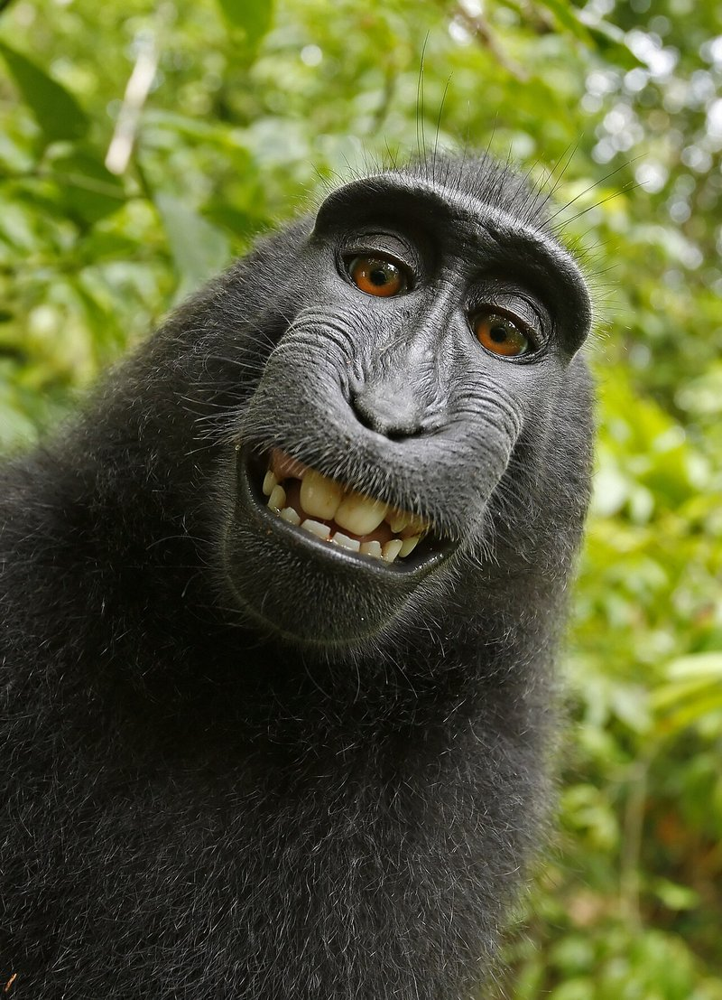

In 2011, a British nature photographer named David Slater hauled his gear into a reserve on the Indonesian island of Sulawesi to shoot a troop of crested macaques. The animals were curious about the equipment. At some point Slater stepped back, and one of them, later identified in court filings as Naruto, got hold of the camera and started pressing the shutter. Most of the frames were junk. A few were not. One of them, a wide-eyed grinning self-portrait, went around the world.

<figure style="margin: 1.5rem 0; text-align: center;">
  
  <figcaption style="font-size: 0.9rem; opacity: 0.75; margin-top: 0.5rem;">One of the <a href="https://en.wikipedia.org/wiki/Monkey_selfie_copyright_dispute" target="_blank" rel="noopener noreferrer">disputed photographs</a>. Public domain, because there is no human author to own it.</figcaption>
</figure>

Then Slater tried to control it, and discovered he could not.

<strong>Nobody owned the picture</strong>

Wikimedia hosted the image and refused Slater's takedown requests, on the theory that a photograph taken by an animal has no human author and therefore falls into the public domain the instant it exists. In 2014 the U.S. Copyright Office updated its registration practices to say plainly that it will not register a work produced by nature, animals, or plants, and it used a photograph taken by a monkey as the example. That language survives today in <a href="https://www.copyright.gov/comp3/chap300/ch300-copyrightable-authorship.pdf" target="_blank" rel="noopener noreferrer">Compendium section 313.2</a>.

Then it got stranger. PETA sued Slater in 2015 on Naruto's behalf, claiming the monkey owned the copyright. In 2018 the Ninth Circuit disagreed, holding in <a href="https://cdn.ca9.uscourts.gov/datastore/opinions/2018/04/23/16-15469.pdf" target="_blank" rel="noopener noreferrer"><em>Naruto v. Slater</em></a>, 888 F.3d 418, that animals lack standing to bring claims under the Copyright Act. Worth being precise here: that ruling was about who may sue, not about whether the photo was copyrightable. The no-human-author point comes from the Copyright Office's practice and from Wikimedia's position, which Slater never overturned in a U.S. court.

Net result: the monkey could not own it, and Slater could not enforce exclusivity over it either. A famous image, commercially valuable, legally unownable.

<strong>Now swap the monkey for a machine</strong>

Every argument Slater made is an argument I hear from engineering leaders about AI-generated code, almost word for word.

<em>He owned the camera.</em> You own the laptop, the repo, and the enterprise seat. Owning the instrument has never conferred authorship. Nobody thinks Canon owns Slater's portfolio.

<em>He set up the shot.</em> He chose the location, the settings, the tripod, and stayed nearby to make it happen. You picked the model, wrote the prompt, and set the guardrails. Staging the conditions under which expression happens is not the same as creating the expression, and how much prompting is enough is exactly the open question being litigated in <a href="https://www.courtlistener.com/docket/69198079/allen-v-perlmutter/" target="_blank" rel="noopener noreferrer"><em>Allen v. Perlmutter</em></a>, where an artist used more than 600 iterative prompts and was still refused registration.

<em>The monkey pressed the shutter.</em> The model generated the code. In both cases, the expressive act belonged to something that is not a person, and copyright attaches to human expression or it does not attach at all.

<blockquote class="quote">Owning the camera was never the same as taking the picture. Owning the subscription is never the same as writing the code.</blockquote>

<strong>The law has since caught up</strong>

<em>Naruto</em> was the warm-up act. The main event was <a href="https://media.cadc.uscourts.gov/opinions/docs/2025/03/23-5233.pdf" target="_blank" rel="noopener noreferrer"><em>Thaler v. Perlmutter</em></a>, in which the D.C. Circuit held in March 2025 that a work generated entirely by AI, with no human author, is not eligible for copyright. On March 2, 2026, the Supreme Court <a href="https://www.supremecourt.gov/search.aspx?filename=/docket/docketfiles/html/public/25-449.html" target="_blank" rel="noopener noreferrer">denied certiorari</a>. A cert denial is not an endorsement of the lower court's reasoning and it decides nothing on the merits, but the practical effect is what matters to you: the human authorship requirement stands as settled U.S. law unless Congress changes it. I wrote about that order <a href="/blog/ai-code-copyright-supreme-court-cert-denied/">when it came down</a>.

The Copyright Office's <a href="https://www.copyright.gov/ai/" target="_blank" rel="noopener noreferrer">AI guidance and reports</a> land in the same place. Meaningful human creative input is required. AI-assisted works can be protected, but only in the portions a human actually authored. The machine-generated portions sit where the monkey selfies sit.

<strong>All that it entails</strong>

"No copyright" sounds abstract until you spell it out for a codebase.

<em>No lawful monopoly.</em> Copyright is the right to exclude. Without it, a competitor who obtains your unprotected code can use it, and you have no infringement claim. That is not a hypothetical remedy gap. It is exactly what Wikimedia did with the selfies, in public, on purpose.

<em>Nothing to license.</em> MIT, Apache, GPL, and your commercial EULA all work by an owner granting permission. Apply a license to code with no copyright holder and you have granted nothing, because there was nothing to grant.

<em>Warranties you cannot honor.</em> Your customer agreements and contractor MSAs almost certainly warrant title and non-infringement in the delivered code. Signing that over material you do not own creates contractual exposure that has nothing to do with copyright law and everything to do with what you promised.

<em>Diligence exposure.</em> Fundraising, M&A, and IP audits all ask the same question in different words. Representing an AI-generated codebase as proprietary intellectual property is the kind of claim that gets tested against commit history and prompt logs, and those records are discoverable.

<em>Revenue is not ownership.</em> You can absolutely sell software you do not own. You just cannot stop anyone else from selling it too. Customers paying you confers no exclusivity and builds no defensible asset.

<strong>What to actually do</strong>

None of this is an argument against using AI. It is an argument for being deliberate about where the human sits. Keep a person doing the expressive work on anything you intend to own, particularly your differentiating code. Document that authorship as you go, in commits, design records, and review history, rather than reconstructing it under subpoena. Adopt a written AI usage policy and make sure your contractor and vendor agreements address AI use, authorship, and IP allocation explicitly. And treat purely AI-generated portions as unprotected, because that is what they are.

The ownership half of this is settled. Other pieces are not: fair use for AI training is still live, with the Third Circuit's ruling in <a href="https://www.courtlistener.com/docket/70622297/thomson-reuters-enterprise-centre-gmbh-v-ross-intelligence-inc/" target="_blank" rel="noopener noreferrer"><em>Thomson Reuters v. Ross</em></a> pending, and the line for AI-assisted works is still being drawn. But you do not get to wait for those before deciding how you build.

Slater spent years and a lot of money learning that owning the camera was not enough. You can learn it for free. Start with the <a href="https://whoownsthecode.com/assessment" target="_blank" rel="noopener noreferrer">risk assessment at whoownsthecode.com</a>, which scores your exposure on both the inbound and outbound axes, and the <a href="https://whoownsthecode.com/faq" target="_blank" rel="noopener noreferrer">FAQ</a> if you want the short answers first. If you are new to the topic, my <a href="/blog/who-owns-ai-generated-code/">overview post</a> is the place to begin.

<em>This post is provided for educational purposes and does not constitute legal advice. Talk to a qualified IP attorney about your specific situation.</em>

