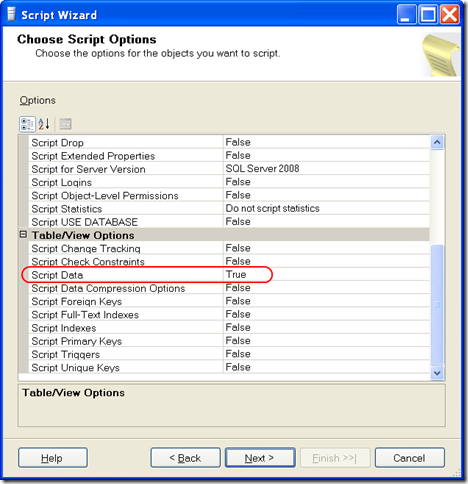
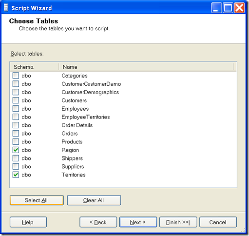
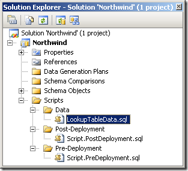

Microsoft has yet to provide us with some kind of utility to handle the importing, managing, versioning, and deploying of data along with our schema changes inside Visual Studio Team System 2008 database projects. For most of the teams I work with, their needs are simple: they just want the ability to store data (INSERT statements are fine) in scripts within their database projects. Ideally the project would be smart enough to know which version of data goes with which version of schema, but for now they’re able to live with handling that manually.
 
Here’s one solution, albeit a manual one:
 
1. Create a database project. 2. Import database schema. 3. Launch SQL Server Management Studio (2008 version). 4. Right-click on the database and select Tasks &gt; Generate Scripts. 5. Select the database and under Script Options deselect everything except for "Script Data".
 
&nbsp;&nbsp;&nbsp; &nbsp;&nbsp; 
 
6. Click Next and select just the Tables you want (ideally just the smaller, static/lookup tables).
 
&nbsp;&nbsp;&nbsp;   
 
7. Click Next and specify the file to generate – something like LookupTableData.sql and let it rip. 8. You can now take that script and add it to your database project in a folder for data-related scripts.
 
&nbsp;&nbsp;&nbsp;  
 
Ideally you would link in the INSERT script(s) to your <a href="http://msdn.microsoft.com/en-us/library/aa833410(VS.80).aspx" target="_blank" rel="noopener">Post-Deployment script</a> to automatically populate the data tables upon deployment. You can also use the option in the Generate Scripts dialog to give you one file per table, to maximize your versioning options. If you are already using <a href="http://msdn.microsoft.com/en-us/library/aa833211(VS.80).aspx" target="_blank" rel="noopener">Data Generation Plans</a>, be careful to not overlap what they are already doing. For more information, be sure to read Barclay Hill’s <a href="http://blogs.msdn.com/bahill/archive/2009/03/30/managing-data-motion-during-your-deployments-part-1.aspx" target="_blank" rel="noopener">Part 1</a> and <a href="http://blogs.msdn.com/bahill/archive/2009/07/02/managing-data-motion-during-your-deployments-part-2.aspx" target="_blank" rel="noopener">Part 2</a> of a posting on how to manage data motion during your deployments.
