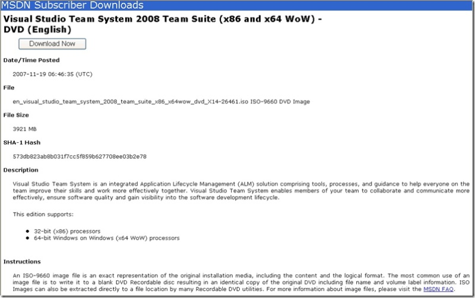

Hmmm ... it still has that fresh .ISO smell.
 
Seems that we'll have something extra to be thankful for this week. VSTS 2008 Team Suite is available for download today!
 
 
 
I hope you are an MSDN subscriber, so you can access the <a href="http://msdn2.microsoft.com/en-us/subscriptions/default.aspx" target="_blank" rel="noopener">subscriber downloads</a>.
