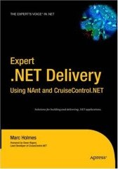

Some students told me about this book, and I think I'll pick it up. <a href="http://www.teamsystem.info/" target="none" rel="noopener">Steven Borg</a> just bought a copy as well.

&nbsp;

The book is titled "<a href="http://www.amazon.com/gp/product/1590594851" target="none" rel="noopener">Expert .NET Delivery Using NAnt and CruiseControl.NET (Expert's Voice in .Net)</a>", a hardcover by <a href="http://www.marcmywords.org/" target="none" rel="noopener">Marc Holmes</a> (APress) and has received good reviews.

