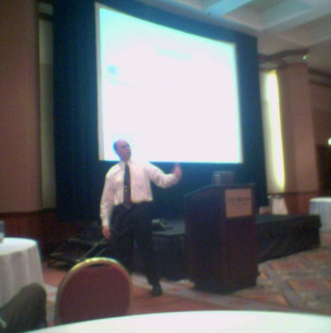

This years <a href="http://www.devessentials.com" target="none" rel="noopener">conference</a> looks to be really good. This is the 3rd year, and there are many Fox, .NET, and SQL folks here at the Westin Crown Plaza in Kansas City, MO.

Here are some other bloggers at the event: <a href="http://www.pointweb.net/blog/category.aspx?i=2" target="none" rel="noopener">Bill Sempf</a>, <a href="http://www.craigberntson.com/blog/blogger.asp" target="none" rel="noopener">Craig Bernston</a>, <a href="http://geekswithblogs.net/jjulian" target="none" rel="noopener">Jeff Julian</a>, and <a href="http://danagonistes.blogspot.com" target="none" rel="noopener">Dan Fox</a>.

<a href="http://www.ronin-intl.com/company/scottAmbler.html" target="none" rel="noopener">Scott Ambler</a> is just now giving the DevEssentials keynote. He's a methodologist with <a href="http://www.ronin-intl.com" target="none" rel="noopener">Ronin International</a>&nbsp;and is going to give us his no-bull, blatant explanations of agile, dispelling some nyths, and listing the more popular methodologies out there.

Scott is the motivation behind <a href="http://www.agilemodeling.com" target="none" rel="noopener">Agile Modeling</a> (a practice-based methodology for effective modeling and documentation of software-based systems) as well as <a href="http://www.agiledata.org" target="none" rel="noopener">AgileData.org</a> (bringing data professionals and application developers together). 

Poor photo, I know, but what can you expect from my <a href="http://www.samsung.com/Products/MobilePhone/GSM/MobilePhone_GSM_SGH_E715.asp" target="none" rel="noopener">Samsung e715 camera phone</a>?
