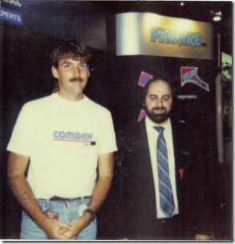

Wow, I found this old photo of me at COMDEX in 1990. It was my first such event, and I was completely blown away by the size of it - and who was there. I remember Borland had a giant quiz-show, asking questions and giving away prizes if you got the answers correct. I met <a href="http://www.duntemann.com/" target="_blank" rel="noopener">Jeff Duntemann</a>, who was the editor of <a href="http://www.duntemann.com/vdmarchive.htm" target="_blank" rel="noopener">PC Techniques</a> magazine.

I also met <a href="http://en.wikipedia.org/wiki/Phil_Katz" target="_blank" rel="noopener">Phil Katz</a> (think "PK") at the event. He had become a hero to the BBS community, because his PKXARC/PKARC software was good at compressing files for transfer over 300 baud modems. After he was sued by SEA, he released an even faster PKZIP and became everyone's best friend. Most everyone in the world still uses PKZIP, or a derivative today.

Unfortunately, Phil Katz lead a troubled life and he <a href="http://en.wikipedia.org/wiki/Phil_Katz#Alcoholism_and_death">died from alcoholism</a> at age 37. Here is an <a href="http://www.bbsdocumentary.com/library/CONTROVERSY/LAWSUITS/SEA/pkzip.htm" target="_blank" rel="noopener">article</a> on his life.

