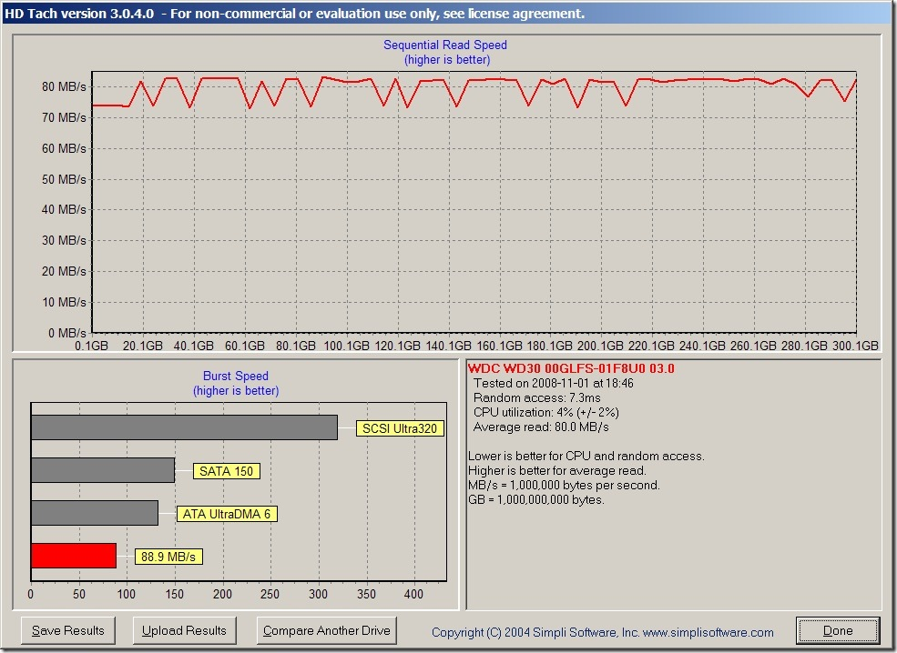

So I splurged recently and picked up one of the new Western Digital 300GB SATA VelociRaptor drives. I also happened to be in Las Vegas, and there was a Fry's nearby. I think that was the cause, and the effect was me ending up with the drive, but I digress. Every so often, I wonder how fast my various 5400, 7200, and 10000 RPM drives are, especially taking USB 2.0 and ESATA into account. I downloaded the latest version of <a href="http://www.simplisoftware.com/Public/index.php?request=HdTach" target="_blank" rel="noopener noreferrer">HDTach</a> and went to work with my not-very-scientific performance tests:

<table border="0" cellspacing="0" cellpadding="2">

<tbody>

<tr>

<td width="325"><u>Hard Drive</u></td>

<td align="middle" width="100"><u>Random Access</u></td>

<td align="middle" width="100"><u>CPU Utilization</u></td>

<td align="middle" width="100"><u>Average Read</u></td>

<td align="middle" width="100"><u>Burst Speed</u></td>

</tr>

<tr>

<td>Internal Hitachi 100GB 7200RPM</td>

<td align="middle">16.8 ms</td>

<td align="middle">3 %</td>

<td align="middle">41.3 MB/s</td>

<td align="middle">114.6 MB/s</td>

</tr>

<tr>

<td>External 5400RPM (USB)</td>

<td align="middle">17.9 ms</td>

<td align="middle">13 %</td>

<td align="middle">32.8 MB/s</td>

<td align="middle">36.2 MB/s</td>

</tr>

<tr>

<td>External 750GB 7200RPM (USB)</td>

<td align="middle">13.9 ms</td>

<td align="middle">0 %</td>

<td align="middle">34.7 MB/s</td>

<td align="middle">35.1 MB/s</td>

</tr>

<tr>

<td>External 750GB 7200RPM (ESATA)</td>

<td align="middle">13.6 ms</td>

<td align="middle">4 %</td>

<td align="middle">66.9 MB/s</td>

<td align="middle">90.4 MB/s</td>

</tr>

<tr>

<td>External 300GB 10000RPM VelociRaptor (ESATA)</td>

<td align="middle"><strong>7.3 ms</strong></td>

<td align="middle">4 %</td>

<td align="middle"><strong>80.0 MB/s</strong></td>

<td align="middle">88.9 MB/s</td>

</tr>

</tbody>

</table>

Hardware used: Dell D820 laptop, 4gb RAM, Windows XP/SP2

BTW - the numbers in bold make me happy, and here's the graphic that went along with the final test (the VelociRaptor drive):

