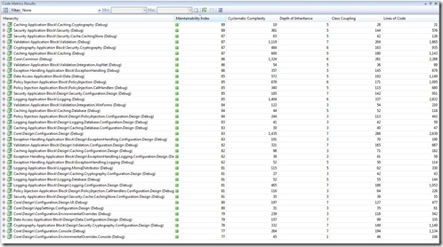

Since first seeing the <a href="http://msdn2.microsoft.com/en-us/library/bb385914.aspx" target="_blank" rel="noopener">Code Metrics</a> feature in the Development Edition of Visual Studio Team System 2008, I've been on a quest for bad (read: unmanageable) code. Rather than face the tool towards my code, I thought I would pick on Microsoft.

... and it looks like the EntLib has a maintainability index between 77 and 89.

 

Thanks to <a href="http://blogs.msdn.com/ajoyk/" target="_blank" rel="noopener">Ajoy krishnamoorthy</a> for actually doing the hard work on this.
