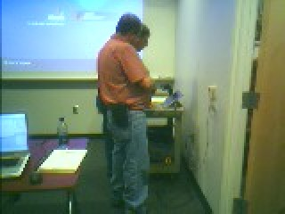
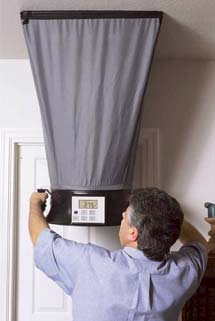

... to make it cooler in our training room.

Ok, here's the formula: Take 2 HVAC technicians ...

A laptop, network cable, one hour of time, and one of these funky things ...

and before you know it, our training room (and less grumpy students) are&nbsp;cool!
