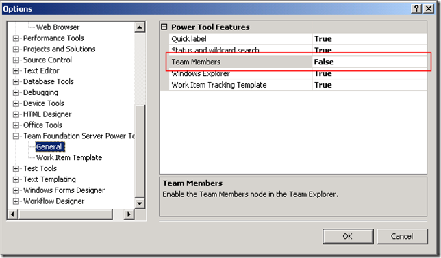
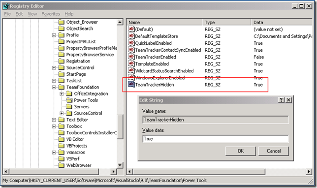

Some Team System users are complaining about problems with the <strong>Team Members</strong> feature included in the <a href="http://www.microsoft.com/Downloads/details.aspx?FamilyID=fbd14eea-781f-45a1-8c46-9f6ba2f68bf0&amp;displaylang=en" target="_blank" rel="noopener">Team Foundation Server Power Tools – October 2008 Release</a>. For team projects with many members, the load time can be excessive. Other problems have cropped up as well. For instance, one user reported that their <strong>Windows Communicator</strong> freezes during long TFS operations like "get latest". Although the <strong>Team Members</strong> plug-in has some very useful features, you may find that it’s more trouble than it’s worth for your particular situation. In this case, you have two options:
 
<strong>Option 1: Disable the Team Members feature.</strong> In the Visual Studio, navigate to <strong>Tools –&gt; Options –&gt; Team Foundation Server Power Tools –&gt; General</strong>, then set <strong>Team Members</strong> to <strong>False</strong>.
 
 
 
This does not remove the <strong>Team Members</strong> node from your team projects in <strong>Team Explorer</strong>, but the node no longer does anything. Also, some of the <strong>Team Members</strong> start-up logic still executes. If this continues to cause problems for you, then try this more drastic fix: 
 
<strong>Option 2: Registry hack.</strong> This is a more complete way of disabling the <strong>TeamMembers</strong> feature, but it cannot be done in the Visual Studio IDE.&nbsp; Using the <strong>RegEdit</strong> utility, navigate to:
 <blockquote> 
<strong>HKCUSoftwareMicrosoftVisualStudio9.0TeamFoundationPowerTools</strong>
</blockquote> 
Add a new <strong>String Value</strong> named <strong>TeamTrackerHidden</strong> and set its value to <strong>True</strong>.&nbsp; 
 
 
 
This setting tells the <strong>Team Explorer</strong> to not load the <strong>Team Members</strong> plug-in.&nbsp; This will cause the <strong>Team Members</strong> node to appear as a folder with a red X on it, which is mildly annoying. However, this option will definitely eliminate any issues you’re having with the <strong>Team Members</strong> feature.
 
(Thanks to Bill Essary @ Microsoft for providing these work-arounds)
