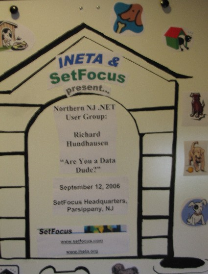

Some people ask me why I named my blog "Tales from the Doghouse", well it's because Hundhausen&nbsp;literally (<a href="http://www.hundhausen.com/familie.htm" target="none" rel="noopener">but not accurately</a>) translates to Doghouse, and "Tales", "Tails", you get the idea. I get a lot of miles out of this when I travel&nbsp;and meet&nbsp;new people. It's great!

Thanks to my friends at <a href="http://www.setfocus.com" target="none" rel="noopener">SetFocus</a> for creating this poster for my <a href="http://www.ineta.org" target="none" rel="noopener">INETA</a> presentation at the <a href="http://www.setfocus.com/n3ug/welcome.aspx" target="none" rel="noopener">Northern New Jersey User Group</a> earlier this month.
