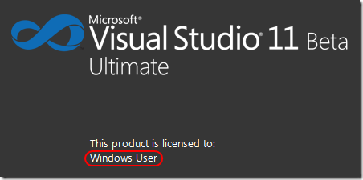
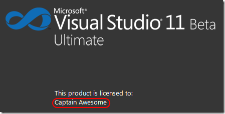

---
title: "I don’t want to be Windows User in my Visual Studio 11 Beta"
date: 2012-03-09T21:01:28Z
authors: ["Richard Hundhausen"]
slug: "i-dont-want-to-be-windows-user-in-my-visual-studio-11-beta"
draft: false
tags: ["Visual Studio"]
---

---

I don’t know why it bothers me so much to see "Windows User" every time I fire up my Visual Studio 11 Beta …
 

 
… but since it does, I thought I would share with you the steps I took to change it. Actually, these steps are not too different from a <a href="https://accentient.com/blog/changingthelicensedtouserinvisualstudio2008.aspx" target="_blank" rel="noopener">previous blog post</a> I made about a previous version of Visual Studio.
 
Using your favorite registry editor (is there more than one?) change the UserName value of the following key:
 
HKEY_LOCAL_MACHINESOFTWAREWow6432NodeMicrosoftVisualStudio11.0Registration
 
If you are still running 32-bit Windows, drop out the Wow6432Node part:
 
HKEY_LOCAL_MACHINESOFTWAREMicrosoftVisualStudio11.0Registration
 
After exiting the registry editor, run devenv /setup from an elevated command prompt. Then, the next time you launch Visual Studio you will see something much more interesting:
 

 
That’s what I’m talking about. <a href="http://abcnews.go.com/US/captain-awesome-douglas-smith-jr-cut/story?id=12353814" target="_blank" rel="noopener">#CaptainAwesome</a>

