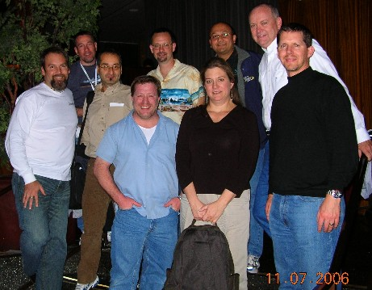

I'm back home now, but had a total blast at DevConnections in Las Vegas this week. I saw many friends and colleagues who I hadn't seen for awhile. I was surprised that there were ~4700 attendees at the show, with quite a large exhibiter hall too. It's really become a mini Tech-Ed.
 From left&nbsp;to right: Richard Hundhausen, Andrew Kelly, Dino Esposito, Peter DeBetta, Brian Moran, Stacia Misner, Rushabh Mehta, Jeff Jones, Douglas McDowell.  Visit my personal photo <a href="http://www.hundhausen.com/album.aspx" target="none" rel="noopener">album</a> for more photos (Conferences &gt; Dev Connections 2006 Las Vegas).