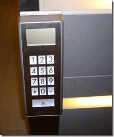
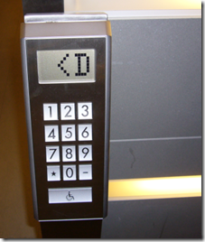
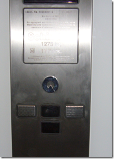

 
 
In Paris for a week and working at <a href="http://www.microsoft.com/france/core/plan-acces-microsoft-france.aspx" target="_blank" rel="noopener">Microsoft’s new "Le Campus"</a>. It’s very new and very cool. One of the coolest things about the building is the smart elevators. They are <a href="http://www.npr.org/templates/story/story.php?storyId=6799860" target="_blank" rel="noopener">not a new thing</a>, but you don’t see them very often in the USA. Here’s how they work.
 
Step 1 – enter the floor you want to go to.
 
 
 
Step 2 – it tells you which car to get in.
 
 
 
Step 3 – ride the car to the floor (there are no controls inside the car).
 
 
 
Why is this better? It groups people together in cars going to similar floors, which makes the trips shorter, faster, and more energy-efficient.
