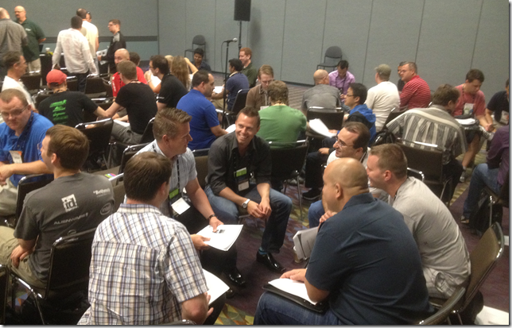

---
title: "Implementing Scrum Using Visual Studio 2012"
date: 2012-06-11T06:52:25Z
authors: ["Richard Hundhausen"]
slug: "implementing-scrum-using-visual-studio-2012"
draft: false
tags: ["Conferences", "Scrum", "TFS", "Visual Studio", "Azure Boards"]
---

---

Updated 6/12/2012 : Since my breakout session today was on the same topic, I thought I would just hitchhike onto this post from Sunday. My presentation and an updated ScrumRobot are available for download below.
 
Wow. What a great pre-conference yesterday at <a href="http://northamerica.msteched.com/preconferenceseminars" target="_blank" rel="noopener">Microsoft TechEd</a> in Orlando. Thanks to <a href="http://elegantcode.com/about/david-starr/" target="_blank" rel="noopener">David Starr</a> and the 80+ folks who were interested enough in the topics to hang out for the all day conversation.
 
 Photo: Teams self-organizing to build a Product Backlog. You can find more photos <a href="http://www.flickr.com/photos/rhundhausen/sets/72157630102805380" target="_blank" rel="noopener">here</a>.
 
The links to the materials are at the bottom, including the RTM version of the Visual Studio Scrum 2.0 template, and my "ScrumRobot" code for setting up areas, iterations, and a product backlog.
 
… and remember, if you need a quick estimate (to get the waterfall guys off your back) just consult the <a href="http://psychic.accentient.com" target="_blank" rel="noopener">‘psychic</a>. 
 

 
Files: <a href="PRC09_Hundhausen.pdf" target="_blank" rel="noopener">Pre-Con Presentation (8.6 mb)</a> | <a href="DEV212_Hundhausen.pdf" target="_blank" rel="noopener">Breakout Presentation (5.9 mb)</a> | <a href="VisualStudioScrum2_RTM.zip" target="_blank" rel="noopener">Visual Studio Scrum 2.0 process template (RTM)</a> | <a href="scrumrobot_rc.zip" target="_blank" rel="noopener">ScrumRobot (for TFS2012 RC)</a>

