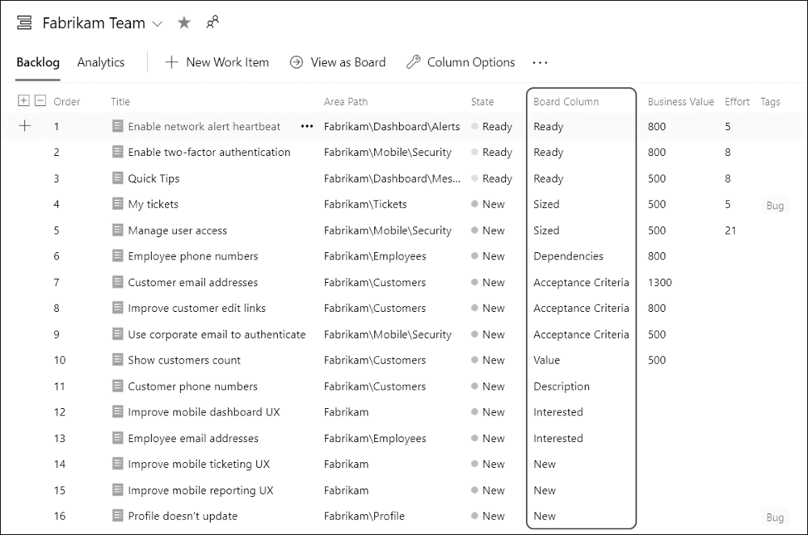

Not all bugs are the same kind of problem, and treating them as if they were leads teams astray. A bug can be found in a product already delivered to production, in a done Increment from a previous Sprint, or in the Increment being developed in the current Sprint. That last category behaves very differently from the first two, and it's worth being deliberate about both.

<strong>In-Sprint bugs: part of the work you're building now</strong>

When you find a problem in the Increment you're developing this Sprint, you're not discovering a defect in shipped software. You're discovering that you aren't done yet. The work simply isn't finished according to the <a href="https://scrumguides.org/" target="_blank" rel="noopener">Definition of Done</a>. A failed test is not a bug; it just means the team isn't done. These in-Sprint problems are handled inside the Sprint as part of completing the forecasted work, not logged, ordered, and deferred like a separate backlog item.

<strong>Out-of-Sprint bugs: real backlog items</strong>

A problem in released product or in a done Increment from a prior Sprint is a different animal. That's genuine new work, and it belongs on the Product Backlog alongside feature requests. It's a smell when I don't see bugs in the Product Backlog. Either the team isn't testing, stakeholders aren't reporting, or, more worryingly, the bugs are living in a separate system that the Product Owner can't order against everything else. Large organizations often have a centralized ticketing system where production bugs begin life. They shouldn't end there. Triage them, and if valid, add them to the Product Backlog so the Product Owner can order them to maximize value. Don't track the same bug in two systems; that's confusing and wasteful.

<strong>Configure Boards for one consistent backlog</strong>

Whichever way you represent bugs, the goal is consistency with the rest of the backlog. Many teams I work with drop the Bug work item type entirely and use the PBI work item type for everything, tagging those PBIs "Bug" and putting repro steps and system information into the Description field. That keeps the Product Backlog holding one type, each with Value and Size for ROI.

If you go that route, configure Boards to match. For an improved experience, select the "Bugs are not managed on backlogs and boards" option in the Working with bugs section of Team Settings.

<figure class="wp-block-image size-large has-custom-border"></figure>

That setting cleans up the UI elements that still reference bugs even after you've stopped using the type, so the team isn't tripping over half-disabled features.

Decide what a bug means to your team, decide where each kind lives, and configure the tool to back you up. Sounds like good Scrum to me.

