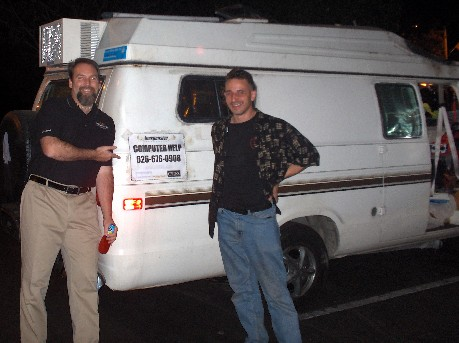

I had a great time last week representing <a href="http://www.ineta.org/" target="none" rel="noopener">INETA</a> and presenting Team System topics to the <a href="http://www.sgvdotnet.org/" target="none" rel="noopener">San Gabriel Valley .NET Developers user group</a> and the <a href="http://www.baynetug.org/" target="none" rel="noopener">Bay .NET user group</a>&nbsp;in Califrnia.

I really enjoyed chating with <a href="http://www.cytex.com/" target="none" rel="noopener">Mike Parker</a>, an MIT grad, Army Reserves officer, sharp software developer, and the owner of this rolling WarDriving mobile-consulting "love van" ...
