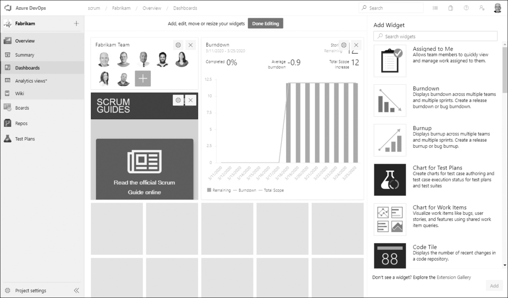
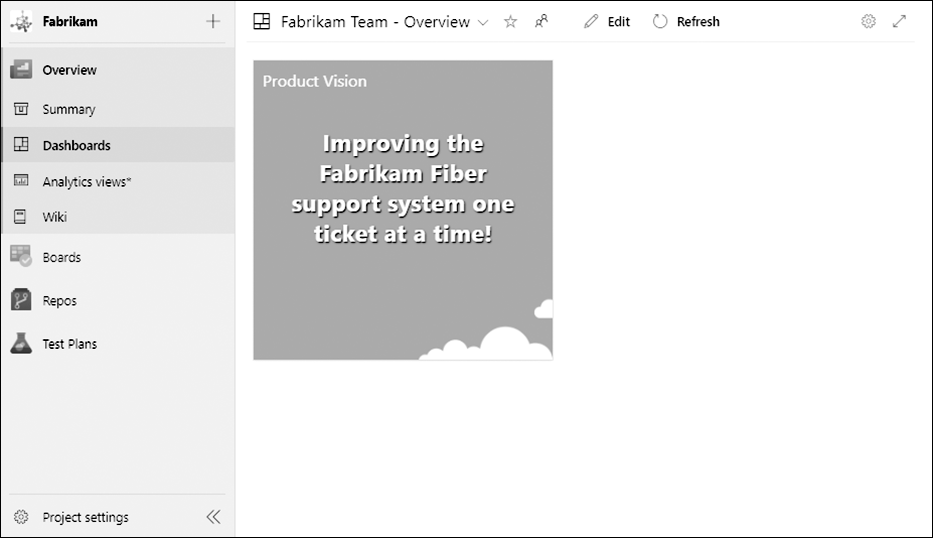

An information radiator is any display, physical or electronic, placed somewhere visible that shows process or product information. The phrase has been around for years, but plenty of teams set one up and then forget the second word. A radiator that nobody looks at, or that shows noise instead of signal, isn't informing anyone. In Azure DevOps, the dashboard is your best radiator, and it's only as good as the widgets you choose to pin.

Every Azure DevOps project has an Overview hub that contains a summary page, one or more dashboards, and a wiki. Initially the Overview is pretty boring. It's up to the team to decide what interesting and valuable content belongs there. Each dashboard hosts an array of widgets, and widgets display specific information such as query results, charts, team members, statistics, or even an embedded webpage. Over two dozen widgets ship out of the box, with more than a hundred more available through the Azure DevOps Marketplace.

<figure class="wp-block-image size-large has-custom-border"></figure>

<strong>Widgets a Scrum Team should consider</strong>

You don't need every widget. You need a handful that answer real questions about the product and the Sprint. Here are the ones I steer Scrum Teams toward:

<ul>
  <li><strong>Sprint Burndown</strong> displays work burndown for a Sprint, by count of work items or sum of Remaining Work. This is the heartbeat of the current Sprint.</li>
  <li><strong>Burndown and Burnup</strong> show progress by backlog level or work item type over a date range, configurable by count or by sum of Business Value, Effort, or Remaining Work. Useful for looking beyond a single Sprint.</li>
  <li><strong>Chart for Work Items</strong> builds a progress or trend chart off a shared work item query, such as showing investment by product area. Query tiles like these turn a saved query into a glanceable number.</li>
  <li><strong>Velocity</strong> helps improve forecasting by displaying the team's velocity, for teams that use it.</li>
  <li><strong>Markdown</strong> lets you add custom text, links, and images, or point at a file in a repository, which is handy for context the team wants front and center.</li>
</ul>

You add these by putting the Overview dashboard into edit mode and dropping widgets from the catalog. Configure each one by team and date range so it shows your data, not generic defaults, and set the dashboard to refresh periodically so it stays current.

<strong>Less can be more</strong>

A radiator that tries to show everything ends up showing nothing. One Product Owner I worked with decided to simplify the Overview dashboard to show only the product vision, using the Product Vision widget. She entered the vision, picked a size and color scheme, and that was it.

<figure class="wp-block-image size-large has-custom-border"></figure>

That's a legitimate choice. The vision is the one thing she wanted everyone to absorb every time they hit the project. A burndown belongs to the team during the Sprint. The vision belongs to everyone, all the time.

Pin the few things that drive a decision or a conversation, drop the rest, and let your dashboard earn its name. Sounds like good Scrum to me.

