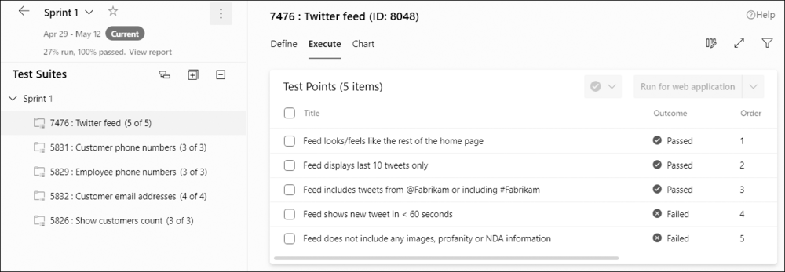
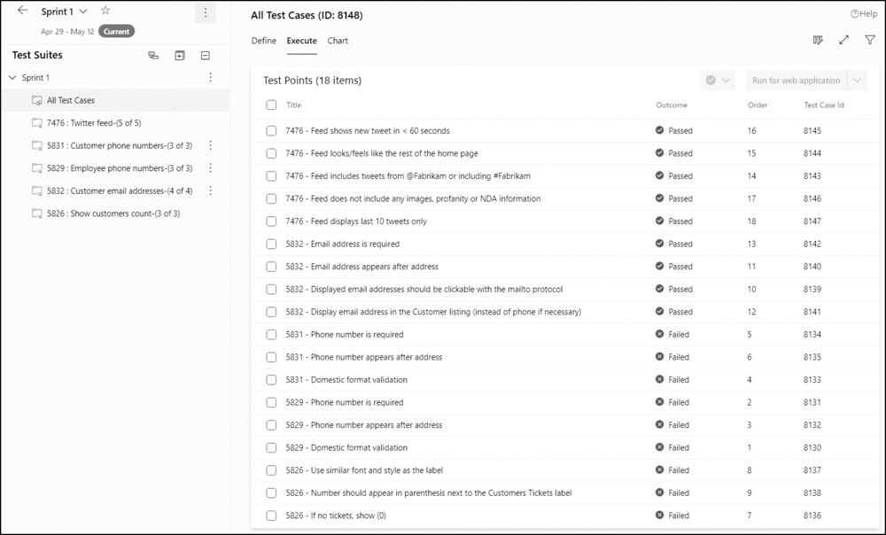

If your forecasted PBIs are expressed as failing acceptance tests, then progress becomes wonderfully simple to read. The more passing tests, the more progress. Right after Sprint Planning there should be zero passing tests. By the end of the Sprint, hopefully, all of them pass. At any point along the way, passing tests divided by total tests roughly equates to progress. The work per test isn't perfectly even, but it's close enough to steer by.

The catch is that Azure Test Plans doesn't give you a first-class way to inspect progress across the whole test plan. There's no single dashboard showing the outcome of every test case across every Requirement-based suite. So you inspect at two levels: one PBI at a time, and across the Sprint.

<strong>Inspecting a single PBI</strong>

For an individual PBI, there's a decent visualization on its Requirement-based suite that shows test progress for just that PBI. It's the easiest way to answer "how close is this one item to Done?"

<figure class="wp-block-image size-large has-custom-border"></figure>

The trade-off is that you have to click through each suite to assemble an overall picture. Tedious, yes, but each click gives you an honest, per-PBI read.

<strong>Inspecting across the Sprint</strong>

To see everything at once, create a Query-based suite that returns all Test Case work items for the current Sprint. Now every acceptance test across every forecasted PBI sits in one list. A query gives you real control over what's included.

<figure class="wp-block-image size-large has-custom-border"></figure>

Two honest limitations. The list can't be ordered to follow the original Backlog Priority, and you'll want a test case naming convention so you can tell which test belongs to which PBI. A small price for one consolidated view.

<strong>Authoring versus execution as a health signal</strong>

Here's the part teams miss. Read the split between authoring and execution as a signal about the plan itself. If it's mid-Sprint and test cases are still being authored rather than executed, the Developers may have planned late or under-specified their criteria. If tests are authored but stubbornly red, the work is harder than the forecast assumed. Either way, that's information to act on now, not at the Sprint Review.

Inspect early, inspect often, and let the tests tell you the truth about your plan. That's the whole point of making them visible.

