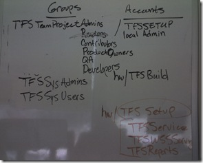
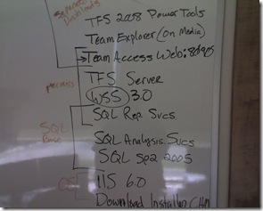

I just had a meeting where we discussed setting up a TFS 2008 production server and I went through the system requirements with our system administrator. The focus was on groups needed in Active Directory, what software is needed on the server, things like that.
 
Here are some camera phone shots of the whiteboard during this discussion. Wow.
 
What's the takeaway from all this? PLAN YOUR IMPLEMENTAION DELIBERATELY. Stand up a research VM and play with it before you decide how you want to set up a production system.
 <h3>Groups and Accounts to Create and Administer</h3> 

 <h3>Things to Install on the Server</h3> 
&nbsp;
