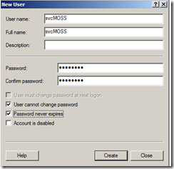
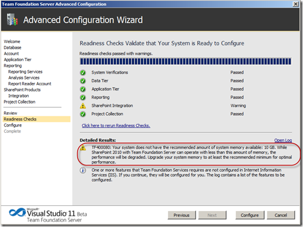
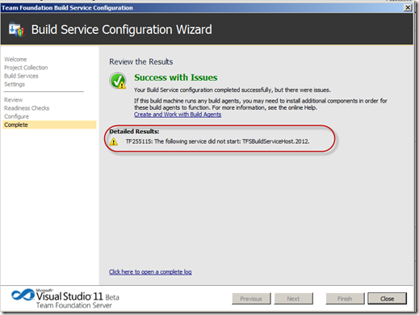

---
title: "Installing the TFS11 Beta"
date: 2012-03-05T18:25:03Z
authors: ["Simon Reindl"]
slug: "installing-the-tfs11-beta"
draft: false
tags: ["TFS", "Microsoft", "SQL Server"]
---

---

<h2>Config</h2> 
To use the new version of TFS on a clean VM, I am going to use the following:
 
VMWare Virtual Machine, 2 Proc, 2 Core 2 GB RAM
 <ul> <li>Windows Server 2008 R2 SP1 64 bit  <li>SQL2012 RC Enterprise – the perspectives are worth it  <ul> <li>This is not officially supported but I would be surprised if it doesn’t work!</li></ul> <li>MOSS 2010  <li>TFS 11  <li>VS 11 Ultimate</li></ul> <h2>Step 1 Read the Manual</h2> 
Download and read the install guide from <a title="http://www.microsoft.com/download/en/details.aspx?id=29035" href="http://www.microsoft.com/download/en/details.aspx?id=29035">http://www.microsoft.com/download/en/details.aspx?id=29035</a>
 
&nbsp;
 <h2>Step 2 Install Windows and Pre-Requisites 
Technorati Tags: <a href="http://technorati.com/tags/TFS11" rel="tag">TFS11</a>,<a href="http://technorati.com/tags/SharePoint" rel="tag">SharePoint</a>,<a href="http://technorati.com/tags/Install" rel="tag">Install</a>
</h2> 
Installed from the media. 
 
Changed the machine name to TFS11
 <h3>Install IIS</h3> 
Have a look at IIS to make sure it woke up properly.
 <h3>Add Application Services Role</h3> 
Added this in with the hostable core. Not essential for TFS – but this will be a build server as well as a general sandpit.
 <h3>Enable Remote Desktop</h3> 
I know i will need it later – so I do it now.
 <h3>Service Accounts</h3> 
Create some service accounts. For my test machines I use the same password, picked up from Brian Randell it is the least secure password that meets Windows security "P2ssw0rd".
 
Rich was using <a href="mailto:P@ssw0rd">P@ssw0rd</a> – try that on a French keyboard when you are used to a UK/US one.
 
 <table border="1" cellspacing="1" cellpadding="2" width="514"> <tbody> <tr> <td valign="top" width="200">Account name</td> <td valign="top" width="309">Use</td></tr> <tr> <td valign="top" width="200">svcSQL</td> <td valign="top" width="309">All SQL services</td></tr> <tr> <td valign="top" width="200">svcTFS</td> <td valign="top" width="309">TFS service account</td></tr> <tr> <td valign="top" width="200">svcMOSS</td> <td valign="top" width="309">Sharepoint and reporting account</td></tr> <tr> <td valign="top" width="200">svcTFSBuild</td> <td valign="top" width="309">Build Account</td></tr></tbody></table>
 
All set to user cannot change, and password never expires.
 

 <h3>SQL 2012 RC</h3> 
Install was straightforward but took a couple of hours. I installed Enterprise so that I could play with perspectives.
 
Installed analysis services, reporting services, and all the tools.
 <h3>SQL 2008 Client Tools</h3> 
Needed to install this to be able to install MOSS 2010 SP1
 <h3>MOSS 2010 SP1</h3> 
Installed all the pre-requisites then MOSS 2010 with SP1. Note that MOSS 2010 is memory hungry, recommending 8GB for production
 
<a title="http://technet.microsoft.com/en-us/library/cc288751.aspx" href="http://technet.microsoft.com/en-us/library/cc288751.aspx">http://technet.microsoft.com/en-us/library/cc288751.aspx</a>
 <h3>TFS11</h3> 
Straightforward install, and I then went through the Advanced configuration as I had installed all the prerequisites.
 
it was quick and painless, however I did get a warning about memory. This is because SharePoint wants 8GB, and TFS needs 2 GB.
 
The minimum to install is 4 GB, under that you will get blocked.
 

 
&nbsp;
 <h3>Build Agent</h3> 
The only other noteworthy point was that I received an error message configuring the build agent:
 

 
I went in to the admin console, bounced the controller and the agent and all was good.
 
&nbsp;
 
A very easy install and configuration, building on the great work with 2010. Great use of Wix!

