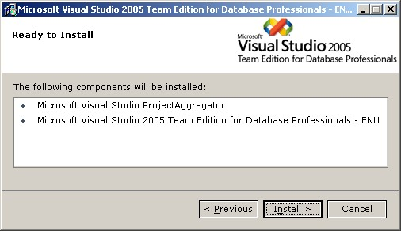

This edition became available last Thursday on MSDN. Hazzah!

I've noticed when installing the edition, as well as the CTPs, that it also installs the "ProjectAggregator" ...

A quick search of the <a href="http://forums.microsoft.com/MSDN/default.aspx?ForumGroupID=5&amp;SiteID=1" target="none" rel="noopener">forums</a>, finds a <a href="http://forums.microsoft.com/MSDN/ShowPost.aspx?PostID=479029&amp;SiteID=1" target="none" rel="noopener">post</a> by Robert Merriman (MS) explaining what the ProjectAggregator is ...

"We use the Visual Studio ProjectAggregator to integrate our package into Visual Studio.&nbsp;The ProjectAggregator is from the <a href="http://msdn2.microsoft.com/en-us/vstudio/aa700819.aspx" target="none" rel="noopener">VSIP SDK</a>&nbsp;and here is some information from the April 2006 readme file for the VSIP SDK:

There is a new ProjectAggregator2 MSI for project systems to leverage. A new aggregator (ProjectAggregator2) was added to the Visual Studio SDK to replace the following two aggregators:

<ul>
<li>ProjectAggregator: included with Visual Studio 2005, used for project flavors (also known as project subtypes)
<li>NativeHierarchyWrapper: included in previous SDK CTPs, used by the MPF project samples</li></ul>

In addition to solving the problems the NativeHierarchyWrapper solved (source code control support for projects implemented in managed code), this new aggregator solve a limitation of the original ProjectAggregator (which did not allow for multiple levels of flavoring)."

&nbsp;
