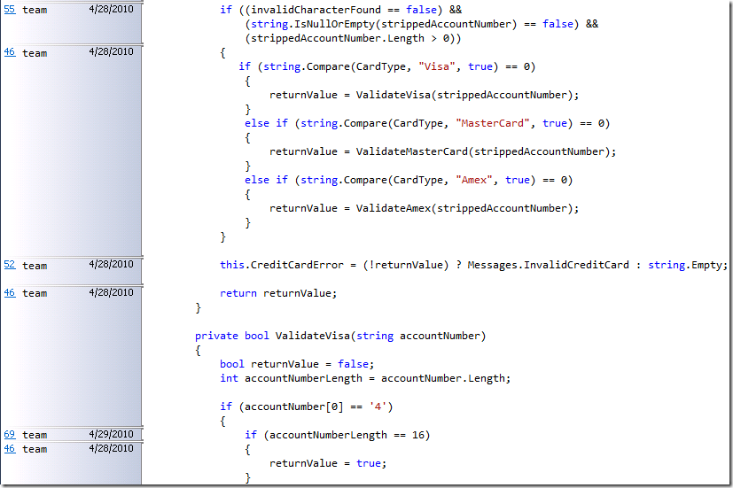

As you know, you can use the <a href="http://msdn.microsoft.com/en-us/library/bb385979.aspx" target="_blank" rel="noopener">TFS Annotate</a> command to learn which team member made a particular change to a particular file. It can also show you who wrote each line of code in a file and when. This tool has many uses, some of them bad, such as blaming a team member who broke the build, failed a test, didn’t conform to the definition of done, etc. In fact, the same feature is Subversion is simply called <a href="http://svnbook.red-bean.com/en/1.4/svn.ref.svn.c.blame.html" target="_blank" rel="noopener">blame</a>.
 
Remember that on a Scrum team, it’s the <em>team</em> that commits to building the product. Good Scrum teams avoid the blame game and instead collaborate and focus on removing impediments quickly. Who broke the build is less important that getting the build working again.
 
Maybe with a little customization the Annotate command could be of value to a Scrum team:
 

