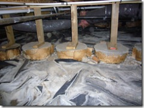
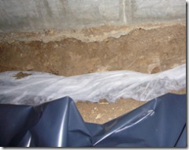
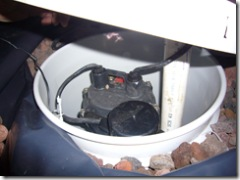
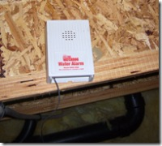
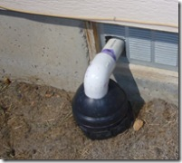
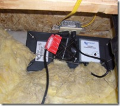

This post is a bit off-topic from the usual techno-geek stuff I blog, but for the last two weeks the fine folks from <a href="http://www.drdrainagesystems.com" target="_blank" rel="noopener">D&amp;R Residential Drainage Systems</a> have been under our house installing a system that ensures that we won't pool water after a heavy rain, yard watering, etc. More importantly, that it won't lead to a festival of bugs, molds, and mildews!
 
<u>The Problem</u>
 
The <a href="http://maps.google.com/maps?f=q&amp;hl=en&amp;geocode=&amp;q=N+Troutner+Way+%26+N+Ashtree+Way,+Boise,+ID+83712&amp;sll=37.0625,-95.677068&amp;sspn=59.898929,109.863281&amp;ie=UTF8&amp;ll=43.610989,-116.160201&amp;spn=0.003399,0.006706&amp;t=k&amp;z=18&amp;iwloc=addr&amp;om=1" target="_blank" rel="noopener">neighborhood</a> we live in has horrible soil - heavy clay content and quite rocky. We're basically on top of table rock here in Boise. This means that the ground does not absorb water well, especially under the house. This spring, I went down in the crawlspace and saw that there had been water pooling:
 
 
 
I didn't see any pipe breaks or problems. After consulting some&nbsp;experts, especially&nbsp;<a href="mailto:d.rdrainagesystems@hotmail.com" target="_blank" rel="noopener">Dan Flynn of D&amp;R</a>, I realized it was just the water from outside coming in and pooling at the lowest point. He tells me many houses are like this in the area.
 
<u>The Solution</u>
 
Dan proposed an under-the-house drainage system.&nbsp;Basically this means the&nbsp;digging of a small trench, just&nbsp;the inside of the foundation, and&nbsp;sloping it&nbsp;down from the corners of the house.
 
 
 
The trenches are filled with rocks and wrapped with a special cloth, which allows the water to be collected and sent down stream. These trenches then feed into two catch buckets at the centers of each end of the house. The buckets contain a 1/2 hp pump for pumping the water out. They also have a battery-operated&nbsp;water alarm connected to it, in case of failure and overflow.
 
&nbsp; &nbsp;&nbsp; 
 
The pump has a float valve which kicks on when the water&nbsp;reaches a certain level, and pumps the water out of the crawlspace and into a clean-out&nbsp;pipe in our yard. They also installed an AC-powered vent, to further control the humidity.
 
 &nbsp;&nbsp;
 
I'm glad I acted when I did, because I don't want to fail an inspection in a few years when I go to sell the place. I also understand that systems like this are fairly common in other parts of the country. Who'2013-08-28 18:34:12'd of known?
