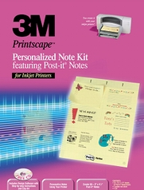
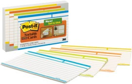

As you know, Visual Studio Team System tracks many different work item types, such as requirements, tasks, and bugs. Many agile teams like to use "sticky notes" to post on the wall to organize their backlog of requirements and tasks and plan their iterations. Even Joel on Software's company is <a href="http://discuss.techinterview.org/default.asp?joel.3.315882.2" target="none" rel="noopener">doing this</a>.

Since I have no life when I travel, I wrote 3M yesterday to see if they manufacture&nbsp;Post-It note sheets that can be fed through a laser/inkjet printer ... and they do!

 

They come in 25, 100, 300 or 500 sheet quantities and&nbsp;I checked a couple of sites, such as <a href="http://www.cdw.com/shop/products/default.aspx?EDC=726869" target="none" rel="noopener">CDW</a>,&nbsp;<a href="http://www.no1network.com/catalog/searchResults.do?searchCriteria=MMM+PC410" target="none" rel="noopener">#1 Online Catalog</a>, and <a href="http://computersunlimitedatl.com/online-catalog.html?v=p&amp;spid=64290&amp;scat=2023" target="none" rel="noopener">Computers Unlimited</a>. The prices range from $0.40 to $0.85/sheet, which might be cost prohibitive. Another cool option might be&nbsp;to use the&nbsp;stackable/sortable <a href="http://www.3m.com/us/office/postit/products/prod_cards_sort.html" target="none" rel="noopener">cards</a> from 3m, although they are not sheet-fed, some printers might be able to "grab them". They come in a few different sizes.

