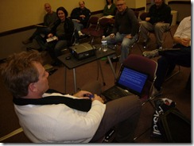

---
title: "Links from my Boise Code Camp 2011 talks"
date: 2011-03-02T11:42:46Z
authors: ["Richard Hundhausen"]
slug: "links-from-my-boise-code-camp-2011-talks"
draft: false
tags: ["Community", "Scrum"]
---

---

Here is a quick post with the materials and links from last weekend at the <a href="http://www.boisecodecamp.com" target="_blank" rel="noopener">Boise Code Camp</a>.
 
<u>Scrum Workshop (with </u><a href="http://sharepoint.ssw.com.au/AboutUs/Employees/Pages/Adam.aspx" target="_blank" rel="noopener"><u>Adam Cogan</u></a><u>)</u>
 <ul> <li><a href="http://www.scrum.org/scrumguides" target="_blank" rel="noopener">Official Scrum Guide</a>  <li>Mike Cohn’s articles on <a href="http://www.mountaingoatsoftware.com/topics/user-stories" target="_blank" rel="noopener">User Stories</a> | <a href="http://www.mountaingoatsoftware.com/topics/planning-poker" target="_blank" rel="noopener">Planning Poker</a>  <li><a href="http://go.microsoft.com/fwlink/?LinkId=197304" target="_blank" rel="noopener">Visual Studio Scrum 1.0 template</a>  <li><a href="http://msdn.microsoft.com/en-us/vstudio/ff433643" target="_blank" rel="noopener">Professional Scrum Developer program</a></li></ul> 
Also, check out the photos from ‘camp on <a href="http://bit.ly/hpniYc" target="_blank" rel="noopener">Flickr</a>. In the meantime, you can enjoy Adam and his blue screen right before our talk.
 

