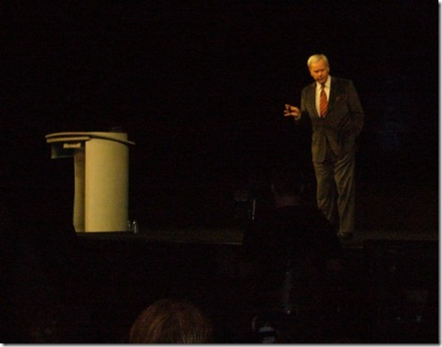
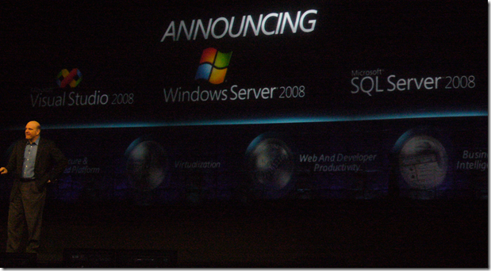

In this, my first post of (hopefully) several today, I'm sitting in the keynote session (next to <a href="http://www.solidq.com/na/MentorDetail.aspx?Id=22" target="_blank" rel="noopener">Douglas McDowell</a>), listening to <a href="http://en.wikipedia.org/wiki/Tom_Brokaw" target="_blank" rel="noopener">Tom Brokaw</a> warm up the audience. What a nice surprise. It definitely stopped all the geeks in their tracks, to listen to his wise words, gathered from years of experience in all matters mankind.
 
&nbsp; 
 
I loved his opening line "I'm not here to write code, or wire this room". He did, however, wax poetic on the future of technology, the spirit and energy of the types of people who will drive it, and how we must handle it to get their safely."
 
Some of his quotes during the keynote (some paraphrasing):
 <ul> <li>"The test or our place in this world is not yet complete. We don't want to become Easter Island or the Mayan civilization. The use of this technology is not just a virtual experience. If we develop capacity and leave out common sense, what then is the reward to each of us, collectively or individually? If speed overruns reason, what else gets trampled?"  <li>"We will not solve climate change by hitting backspace. It will do us little good to wire the world if we short circuit our consciousness, our souls and if we don't use this technology to advance mankind."  <li>"When I left Nightly News I said that I'm not only going to spend my time at suites in the four seasons ... but to spend time in the trenches to meet people who make a difference"  <li>"One day I woke up in Pakistan in a packing container with Americans who had been there for six months, trying to assess medical and health needs. When they hiked out, they put their hands on the keyboard and distilled what they had learned ... and in so doing, made a big impression ... of those of us in the West who have so much, while they (people in Pakistan) have so little."  <li>"This technology takes a guiding hand, an imaginative approach, and a hope ..."  <li>"We have the opportunity to become the next, greatest generation."</li></ul> 
<a href="http://www.microsoft.com/presspass/exec/steve/default.mspx" target="_blank" rel="noopener">Steve Ballmer</a> came on stage next to thank the many platinum sponsors, and discuss how "Dynamic IT" can help manage complexity and achieve agility (especially in the realm software development)
 
 
 
I heard the term "Agile" about 10 times in the span of 3 minutes. More to come ...
