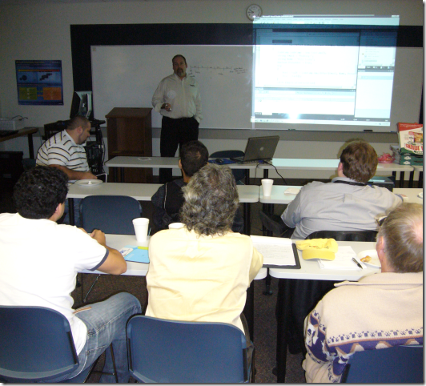

I was in Mobile Alabama for the week talking Team System and got invited to the Lower Alabama .NET User Group (LANUG) to speak on VS 2010 and TDD. This was a fun evening, good pizza, and test-first software development. Thanks to <a href="http://rduclos.wordpress.com" target="_blank" rel="noopener">Ryan Duclos</a> and <a href="http://www.linkedin.com/in/matthewjosephhughes" target="_blank" rel="noopener">Matthew Hughes</a> for coordinating this. if you attended, the files are linked at the bottom.   
 
Attachment: <a href="LANUGDemo.zip" target="_blank" rel="noopener">LANUGDemo.zip</a> (28k)
