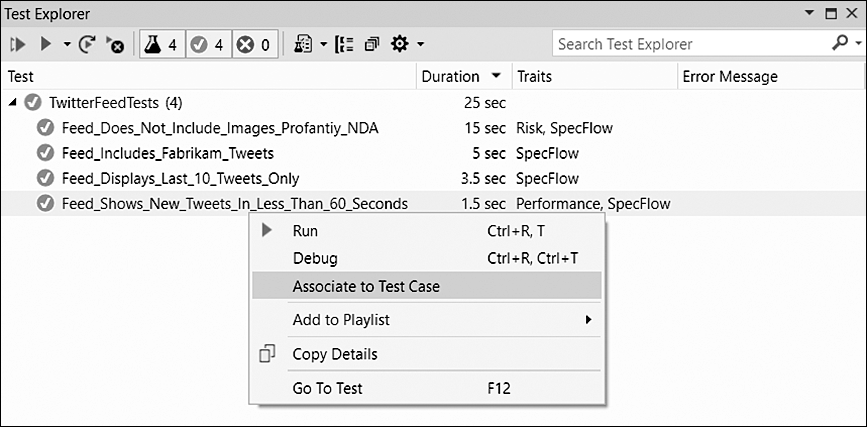
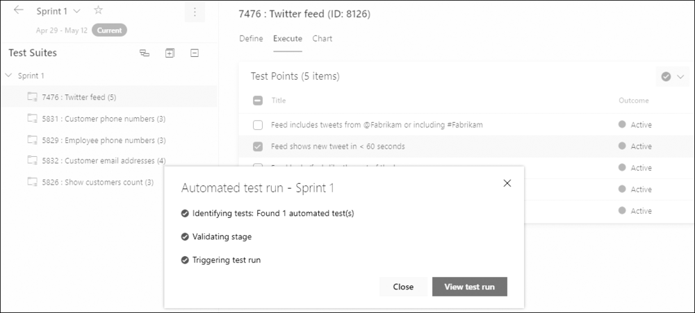

Professional Scrum Developers agree that automated testing is awesome and a must-have. But if your team isn't there yet, "go automate everything" is useless advice. The good news is that the path from manual to automated acceptance tests is gradual, and Azure Test Plans is built to let you walk it one step at a time. Start where you are.

The foundation is already familiar. A Test Case is just another work item type. It can be lightweight, with only a title and description, serving as documentation. Some test cases morph into manual tests with real steps and expectations. Others get associated with an automated test. That last kind is where ATDD practitioners want to end up, and Azure Test Plans, automated tests, and Azure Pipelines together give you the foundation to build it yourself.

<strong>The pragmatic sequence</strong>

You don't flip a switch. You follow a sequence, and you can stop and run at the end of it.

<ul>
  <li>Create a Test Case work item in the current Sprint's test plan, associated with the correct suite and PBI. Setting its Automation Status field to Planned helps you find these later.</li>
  <li>Use Visual Studio to create an automated acceptance test and associate it to that Test Case work item. Supported frameworks include MSTest, xUnit, and NUnit, and types built on them like Selenium and SpecFlow should also work.</li>
</ul>

<figure class="wp-block-image size-large has-custom-border"></figure>

You do the association in Visual Studio's Test Explorer, and you'll need the test case's work item ID. Once it's linked, the Test Case's Automation Status field changes from Planned to Automated, and the test name, storage, and type appear on its Associated Automation page. Only one automated test may be associated with each test case.

<ul>
  <li>Check the test project into Azure Repos, then create a build pipeline that compiles the test binaries. This pipeline only needs to generate the binaries, not run the acceptance tests.</li>
  <li>Create a release pipeline with at least one stage representing the test environment. It needs a Visual Studio Test task, configured to use the "Test run" option so Azure Test Plans passes the selected tests to the pipeline.</li>
  <li>Configure the Sprint's test plan settings, selecting the build and release pipelines and stage.</li>
</ul>

<strong>Run it</strong>

To run, select the suite that contains the automated test case, go to the Execute page rather than Design, choose your tests, and click a Run option. Run With Options gives you the most control, letting you override the defaults.

<figure class="wp-block-image size-large has-custom-border"></figure>

The system creates a release, runs the Visual Studio Test task, and hands you a pass or fail outcome. Those same automated tests then serve you throughout the Sprint for ATDD and later for regression.

You don't have to automate everything this Sprint. Associate one test, wire one pipeline, run it once. Start where you are, and let the practice grow.

