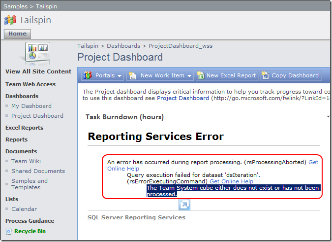
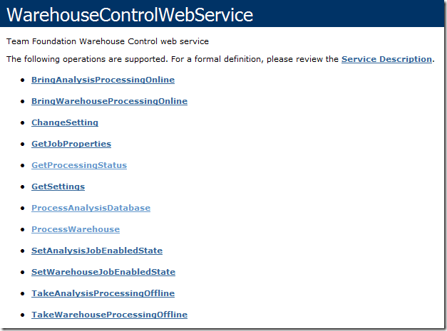
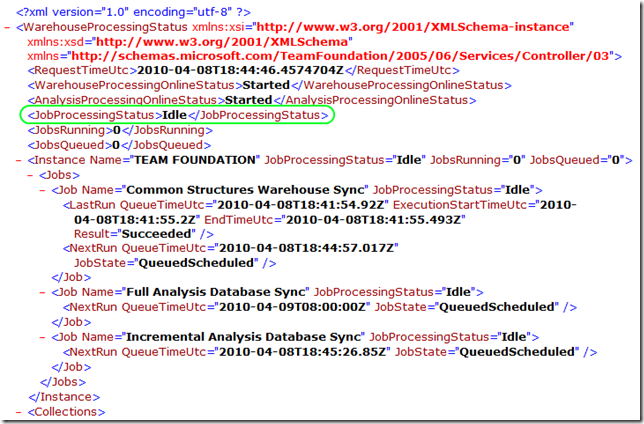
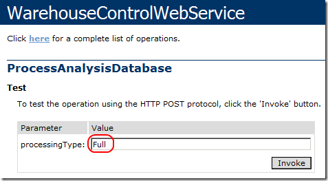
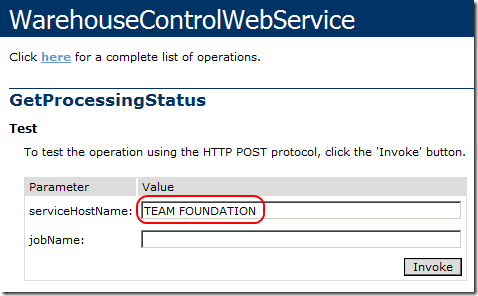
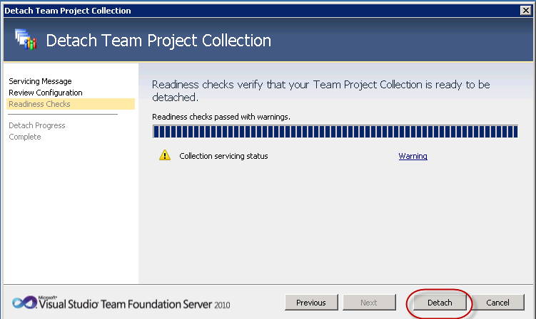
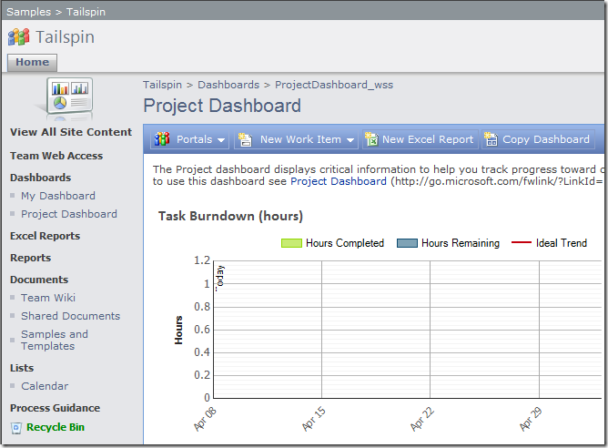

There are many reasons and times that you will want to manually process the TFS 2010 Data Warehouse and Analysis Services databases. The primary reason is that you are impatient and want to see your reports and metrics right away. An example of this is right after you create a new team project, you may see one or more Reporting Services errors on the project portal (see below). These will go away after a period of time (which can be specified) but if you want to clean them up immediately (because you have <a href="http://en.wikipedia.org/wiki/Obsessive%E2%80%93compulsive_disorder" target="_blank" rel="noopener">OCD</a> or something) then you can follow the steps in this post.
 
 
 
Notice the message says "The Team System cube either does not exist or has not been processed." This is your cue to (a) wait for the cube to process itself, or (b) force a process by following these steps:
 <ol> <li>Open the WarehouseControlWebService on the TFS Application Tier by navigating to (for example) <a href="http://localhost:8080/tfs/TeamFoundation/Administration/v3.0/WarehouseControlService.asmx" target="_blank" rel="noopener">http://localhost:8080/tfs/TeamFoundation/Administration/v3.0/WarehouseControlService.asmx</a></li></ol> <blockquote> 
 
</blockquote> <ol start="2"> <li>Click the <strong>ProcessWarehouse</strong> method.  <li>Leave the collectionName and jobName parameters empty and click <strong>Invoke</strong>.  <li>A new browser window will open showing XML with "true" as the value. You can close this window.  <li>Return to the main WarehouseControlWebService page. You can simple click the back button.  <li>Click the <strong>GetProcessingStatus</strong> method.  <li>A new browser window will open showing XML. Keep refreshing this window until the <strong><jobProcessingStatus></strong> tag at the top of the file shows "Idle" (see item in green below) and then you can close this window.</li></ol> <blockquote> 
 
</blockquote> <ol start="8"> <li>Return to the main WarehouseControlWebService page. <li>Click the <strong>ProcessAnalysisDatabase</strong> method. <li>Specify <strong>Full</strong> as the processingType parameter and click <strong>Invoke</strong>.</li></ol> <blockquote> 
 
</blockquote> <ol start="11"> <li>A new browser window will open showing XML with "true" as the value. You can close this window.  <li>Return to the main WarehouseControlWebService page.  <li>Click the <strong>GetProcessingStatus</strong> method.  <li>Specify <strong>TEAM FOUNDATION</strong> as the serviceHostName parameter and click <strong>Invoke</strong>.</li></ol> <blockquote> 
 
</blockquote> <ol start="15"> <li>A new browser window will open showing XML. Keep refreshing this window until the <strong>Full Analysis Database Sync </strong>job shows a JobProcessingStatus of "Idle" (see item in green below) and then you can close this window. </li></ol> <blockquote> 
 
</blockquote> 
That should do it. If you run into any errors, look for details in a ResultMessage tag on the status page.
 
If you return to the newly created team project portal, those error messages have disappeared and been replaced by dashboard reports showing no data – which is an improvement from an error message.
 
 
