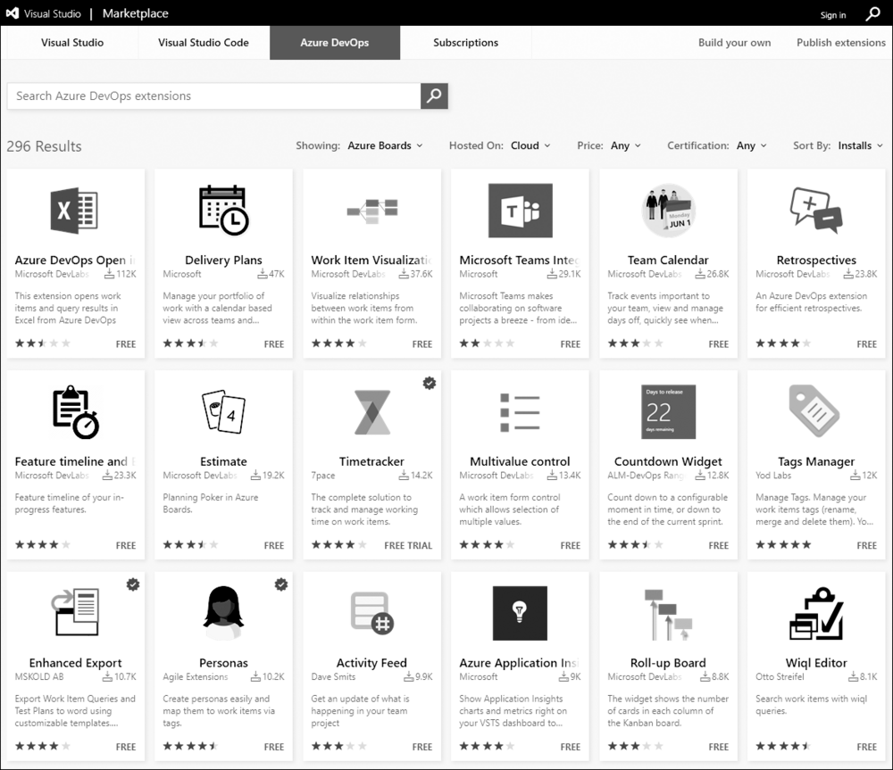
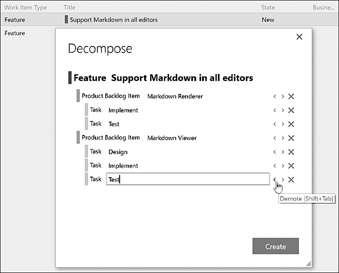

The Azure DevOps Marketplace boasts more than 1,200 extensions across all the services. That's a lot to wade through, and most teams either ignore it entirely or install a dozen shiny things they never use. Over many years of training and coaching Scrum Teams, I've come up with a short list of extensions that have proven their worth. I'm not saying my list should be your list, but it's a sensible place to start.

<figure class="wp-block-image size-large has-custom-border"></figure>

Before the list, a word on discipline. In the spirit of experimentation, install an extension, use it minimally for one to three Sprints, and form an opinion about its value. At the next Sprint Retrospective, decide whether to keep it, change how you use it, or drop it. That's the same approach a Scrum Team should take with any tool or practice. Don't let the marketplace turn into a junk drawer.

<strong>Extensions that earn their keep</strong>

Here are the ones I reach for when helping a Scrum Team visualize and manage their work:

<ul>
  <li><strong>Decompose</strong> lets you quickly break down work items from epics to features to PBIs to tasks. Keyboard shortcuts promote and demote items between hierarchy levels, so building out a backlog structure goes from tedious to fast.</li>
  <li><strong>Product Vision</strong> lets the Product Owner set the product vision and make it visible to team members and stakeholders. A small thing that does a lot for focus.</li>
  <li><strong>Sprint Goal</strong> displays a Sprint Goal right on the Sprint page, which is exactly where the team should be looking at it.</li>
  <li><strong>Definition of Done</strong> lets you view and modify your team's Definition of Done, visualize it on each PBI, and even use it as a confirmation step before moving work to Done.</li>
  <li><strong>Team Calendar</strong> tracks the events that matter to the team, including days off and when Sprints start and end.</li>
  <li><strong>Retrospectives</strong> handles the collecting, grouping, voting, and visualizing of feedback during a Sprint Retrospective.</li>
  <li><strong>Azure DevOps Open in Excel</strong> opens work items and query results in Excel, which is still the fastest way to do certain bulk edits.</li>
</ul>

Decompose is the one I'd install first. Building a clean hierarchy of epics, features, PBIs, and tasks is foundational work, and doing it by hand in the browser is slow.

<figure class="wp-block-image size-large has-custom-border"></figure>

<strong>One permissions note</strong>

Only organization owners and Project Collection Administrators can install an extension. If you don't have those permissions, you can request one instead, and an administrator approves it. The delay in that request-and-approve loop is proportional to how agile your organization is, or isn't. My advice: make a trusted Scrum Team member a Project Collection Administrator so they can install and evaluate without friction.

Install a few, inspect their value, adapt accordingly. Sounds like good Scrum to me.

