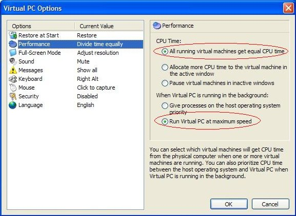

Been playing with a lot of beta software lately, so you know what that means - learning all the ins/outs of Virtual PC 2004. I picked up a few cool tricks at Tech-Ed last week, too.

As far as performance tuning, I've got to say, that balancing the memory between the host and guest is important, but as soon as I checked these two boxes (unders Files - Options - Performance from the Virtual PC Console), performance really picked up:
