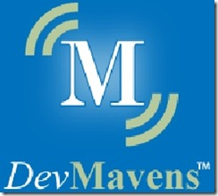

I met up with <a href="http://stevesmithblog.com" target="_blank" rel="noopener">Steve Smith</a> at PDC last week, as well as <a href="http://www.west-wind.com/Weblog" target="_blank" rel="noopener">Rick Strahl</a> and <a href="http://jeffreypalermo.com" target="_blank" rel="noopener">Jeffrey Palermo</a> (of <a href="http://www.partywithpalermo.com" target="_blank" rel="noopener">Party with Palermo</a>). It seems that these guys along with some other respected technologists (Hanselman, Guthrie, Osherove, and Howard) are aggregating over at <a href="http://www.devmavens.com" target="_blank" rel="noopener">DevMavens</a>. The term Maven means an expert, connoisseur, or a person with special knowledge, which these guys have plenty of.
 

