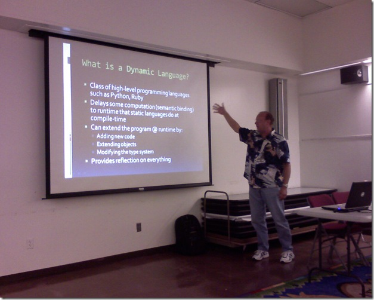

I got an opportunity to attend the <a href="http://www.lacsharp.org/" target="_blank" rel="noopener">LA C# User Group</a> tonight, and listen to <a href="http://mvasoftware.com/" target="_blank" rel="noopener">Mike Vincent</a> speak on this subject. I'm familiar with the concepts and capabilities of dynamic languages, but looked forward to getting my questions answered.
 
 
 
The behaviors of a dynamic language include several cool behaviors:
 <ul> <li>Extend the program by adding new code  <li>Extend objects and definitions  <li>Modify the type system</li></ul> 
The downside:
 <ul> <li>No compiler safety net  <li>IDE maturity such as Intellisence  <li>TDD becomes very important</li></ul> 
The Dynamic Language Runtime (DLR) adds a set of services on top of the CLR to support dynamic languages. It will be distributed with <a href="http://www.silverlight.net" target="_blank" rel="noopener">Silverlight</a>, <a href="http://www.codeplex.com/IronPython" target="_blank" rel="noopener">IronPython</a>, and <a href="http://www.ironruby.net" target="_blank" rel="noopener">IronRuby</a>. Here's a cool graphic <a href="http://www.hanselman.com" target="_blank" rel="noopener">Scott Hanselman</a> posted last year that explains the roadmap past, present, and future:
 

 
Other notes:
 <ul> <li>The Silverlight CLR 2.0 won't support CodeDOM, so the need for a dynamic language really becomes evident.  <li><a href="http://www.djangoproject.com/" target="_blank" rel="noopener">Django</a> is a high-level framework for Python comparable to <a href="http://www.rubyonrails.org/" target="_blank" rel="noopener">Ruby on Rails</a>, and at <a href="http://us.pycon.org/2008/about/" target="_blank" rel="noopener">PyCon 2008</a> (March 2008) Microsoft demonstrated Django's use on Iron Python  <li><a href="http://www.iunknown.com/" target="_blank" rel="noopener">John Lam</a> demonstrated Ruby on Rails running on IronRuby at <a href="http://en.oreilly.com/rails2008/public/content/home" target="_blank" rel="noopener">RailsConf</a> (May 2008)</li></ul> 
On a side note, one of the attendees told me about the <a href="http://code.google.com/appengine/" target="_blank" rel="noopener">Google App Engine</a>, allowing you to run your application on Google's infrastructure.
 
You can download Mike's presentation <a href="http://mvasoftware.com/media/p/47.aspx" target="_blank" rel="noopener">here</a>.
