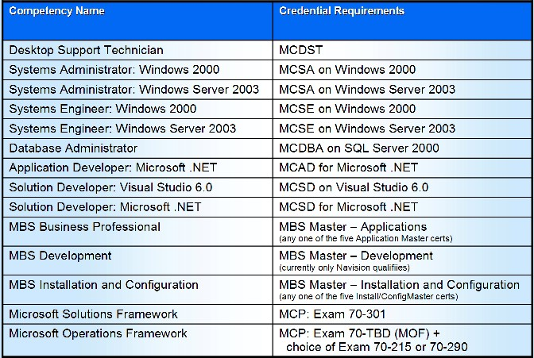
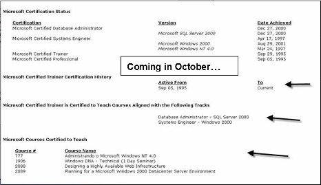

This morning, Ken Rosen, MCT Worldwide Program Manager, showed how Microsoft is raising the bar for 2005. Keeping in mind that the 2005 MCT program guide hasn't been finalized, he delivered to us the following bits of good news:

<strong>#1 - Trainer Certification at the Competency Level</strong>

<ul>
<li>Trainers will be identified by their areas of expertise (MCAD, MCSD/VB6, MCSD/.NET, MCSA, MCSE, MCDBA, MCDST, MSF, MOF, etc.) and this will determine which courses may be delivered; some courses may be delivered by trainers from different competencies; some courses may require more than one competency; the final list will be published in the months ahead
<li>Mandatory certification upgrades are gone; for example,&nbsp;MCSD/VB6 will&nbsp;only be allowed to teach those relevant courses; this a way of rewarding early adopters
<li>Here is a list of the competencies:  </li></ul>

<strong>#2 - Stronger Trainer Quality</strong>

<ul>
<li>All MCTs will be required to use the Metrics-That-Matter (MTM) Website to track their classes and evaluations
<li>MCT must have 10 MTM evaluations in previous two&nbsp;quarters
<li>Quarterly auditing of MCTs' scores will be performed automatically, looking at the % of Very Satisfied (VSAT 8-9) as well as the % of the Dissatisfied (DSAT 1-4)
<li>Get bad scores in a quarter and you'll get a warning; get bad scores in two quarters, and you'll get decertified
<li>A new MCP portal will allow MCTs to pulish their transcripts and, optionally, their performance metrics (VSAT, DSAT, # of times taught, # of students taught)&nbsp;to those they choose (by giving out an access code)  </li></ul>

<strong>#3 - No inactive status in 2005</strong>

<ul>
<li>All MCT history will be retained, so if you drop out for a couple of years, then rejoin the program, your transcript will just show a gap.
<li>No more continuing education requirements; since we are now watched on a quarterly basis, there's no need to track CECs or TECs
<li><em>Cool!</em> - The above rule is retroactive for <strong>this year</strong>, so quit tracking your CECs and TECs and, if you're an independent like me, no need to sit a week of training and lose revenue</li></ul>
<ul></ul>

<strong>#4 - Microsoft Certified Learning Consultant (MCLC) </strong><em>- saved the best for last!</em>

<ul>
<li>This is best described as a premier trainer certification&nbsp;for senior trainers who develop and deliver consultative learning solutions to large/entrprise customers
<li>This is a work in progress at this point, but looks like it will require (a) MCT, (b) a recent, relevant Case Study, (c) better than average&nbsp;VSAT scores, (d) and more requirements to be announced ...</li></ul>

Those were the highlights. Many cool changes&nbsp;coming&nbsp;down the pipeline.&nbsp;Stay informed!

BTW - Here are some interesting MCT factoids ...

<ul>
<li>With NT4, only 88% of the students were &#8220;new to IT&#8220;
<li>With W2000, 72% of the students were &#8220;new to IT&#8220;
<li>With W2003, 49% of the students are &#8220;new to IT&#8220;</li></ul>
<ul>
<li>40% of&nbsp;MCTs have only been MCTs for 0-3 years
<li>38% have been MCTs for 4-6 years
<li>19%&nbsp;have been MCTs for 7-9 years
<li>3% have been MCTs for 10+ years 
<li>51% of MCTs work for CPLS partners (f.k.a. CTECs)
<li>32% are freelance (like me!)
<li>11% are corporate instructors
<li>5% are academic
<li>1% are government 
<li>The average MCT takes 3.5 exams/year
<li>20% took no exams, however</li></ul>