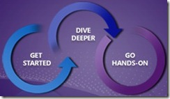

---
title: "Microsoft launches Test Professional Product Tour"
date: 2011-03-07T09:57:29Z
authors: ["Richard Hundhausen"]
slug: "microsoft-launches-test-professional-product-tour"
draft: false
tags: ["Visual Studio"]
---

---

Microsoft just launched the "Test Professional Product Tour". Whether you are new to Visual Studio 2010 Test Professional or have some experience using it, this tour provides customers with a 200-level experience that can be followed-up with the downloading of the trial edition.      First, visit <a href="http://www.microsoft.com/visualstudio/test" target="_blank" rel="noopener">this site</a> for the tour and then when you are reading to download and go hands-on, visit <a href="http://www.microsoft.com/visualstudio/en-us/try/test-professional-2010-tour" target="_blank" rel="noopener">this site</a>. 
