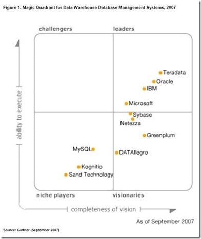

Way to go Microsoft, and SQL Server 2005!
 
 
 
For the first time in the report’s history, Microsoft is positioned in the Leader quadrant in Gartner’s Magic Quadrant for Data Warehouse DBMS. The analysts say that SQL Server 2005 is expected to grow in the data warehouse space and Microsoft’s vision for SQL Server 2008 makes clear the company’s intent to become a major presence in the data warehouse market.  
&nbsp; 
Read more about this great announcement <a href="http://www.microsoft.com/presspass/press/2007/oct07/10-12DWMQPR.mspx" target="_blank" rel="noopener">here</a>.