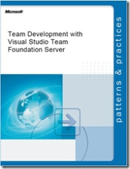

Microsoft's <a href="http://msdn2.microsoft.com/en-us/practices" target="_blank" rel="noopener">Patterns &amp; Practices</a> group&nbsp;recently released the final version of the "Team Development with Team Foundation Server" Guide. This guide has been in beta for the last couple of months.  
&nbsp;  
It&nbsp;shows you how to get the most out of Team Foundation Server to help improve the effectiveness of your team-based software development. Whether you are already using Team Foundation Server or adopting from scratch, you’ll find guidance and insights you can tailor for your specific scenarios. It's a collaborative effort between patterns &amp; practices, Team System team members, and industry experts.  
&nbsp; 
  
&nbsp;  
Some quick facts:  <ul> <li>496 – Total number of pages  <li>18 – Total number of chapters in this guide  <li>11392 – Total number of downloads of the Beta version of this guide  <li>8 – Number of attempts to get the Adobe build to work to generate the guide in .pdf format  <li>60 – Number of external and MSFT contributors and reviewers</li></ul> 
Download the guide from <a href="http://www.codeplex.com/TFSGuide" target="_blank" rel="noopener">CodePlex</a>.