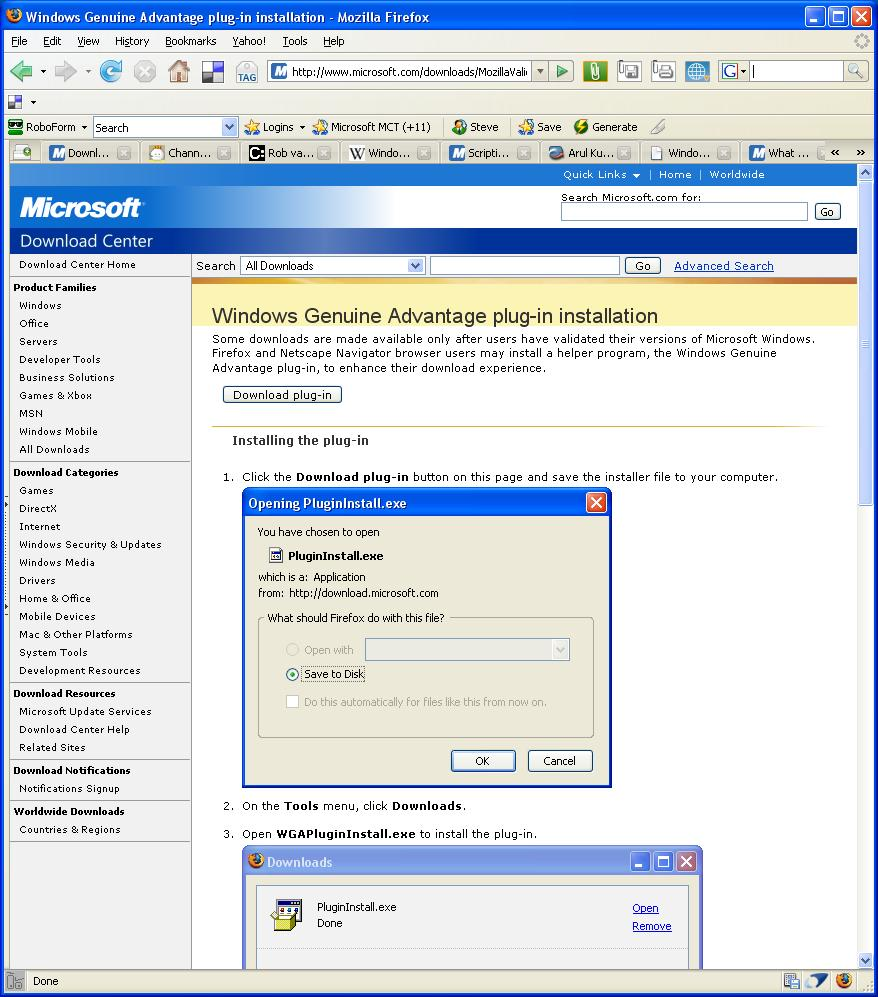

Wow!&nbsp; As I was downloading a file from MSDN that requires Genuine Windows, I was prompted to download the required tool.&nbsp; What was interesting was the prompt!&nbsp; They noticed I was using Firefox and even showed me Firefox screenshots for how to install the Genuine Windows tool!  

