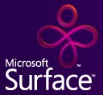

Have you seen this yet? I caught a quick news story this morning on TV about <a href="http://www.microsoft.com/surface/" target="none" rel="noopener">Microsoft Surface</a>.

Here's an article from the <a href="http://www.popularmechanics.com/technology/industry/4217348.html" target="none" rel="noopener">July 2007 issue of Popular Mechanics</a>.&nbsp;There's a really cool video of Microsoft Surface on page 1 and on the interface on page 3 of that article.

BTW - I understand that the technology behind Surface is <a href="http://wpf.netfx3.com/" target="none" rel="noopener">WPF</a>.
