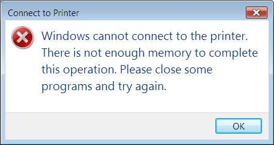

I'm trying to get Vista (on my laptop) to recognize a printer shared from my Windows XP desktop box.&nbsp; Unfortunately, it squacks...&nbsp; Telling me that I don't have enough memory.&nbsp; Now, I have 2 Gig on my laptop, and currently 1.5 Gig is free, so I seriously doubt that's REALLY the case.  

  I've searched and come up with a couple solutions, however, they involve hooking up my printer via an LPT port.&nbsp; I don't have that cable anymore.&nbsp; Who uses those things when USB is available?&nbsp; Anyway, the hack is really to hook up old DOS computers to Windows XP, but evidently it works for Vista, too.&nbsp; If you are running into the same problems, and are using an LPT port, check out the Microsoft KB article <a href="http://support.microsoft.com/kb/314499">here</a>.  UPDATE:&nbsp; See my post here for the solution! 