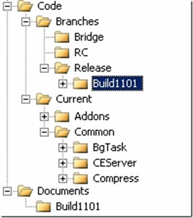

My final talk at <a href="http://vslive.com/2008/sf" target="_blank" rel="noopener">VSLive! San Francisco</a> this week was on one of my favorite topics - parallel development. In other words, dealing with the real-world situations where multiple developers are coding away on the same project, and even the same file.
 
The first order of business was to have a few of the ex-Visual SourceSafers lay down on my couch so we could discuss their phobias and irrational urge to run to their "safe place" - a.k.a. locking.
 
In all seriousness, we discussed the two locking models of TFS and then explored the many wonderful benefits of not using locks by default, known as shared check out. Most in the audience agreed that the benefits of not blocking each other with their routine development (for example, not locking .csproj files when somebody adds a new file) greatly outweighs the detriment of having to deal with a conflict that requires manual intervention. Of course, arguments can be made either way.
 
I pointed out that there are four situations where conflicts can occur that may require auto/manual merging:
 <ul> <li>CHECK-IN - the most obvious; somebody else may have just checked in competing changes just before you  <li>GET - you may already have pending changes on one or more of the files you are trying to download  <li>MERGE - by definition; when you merge changes from one branch to another, the chances are good that you will have to resolve conflicts  <li>UNSHELVE - not so obvious, but this is basically like a GET, just coming from another location in TFS; unfortunately, Team Explorer doesn't know how to handle the detection/resolving of these types of conflicts, so look to the TFPT UNSHELVE power tool for help</li></ul> 
Finally, we looked at setting up a source control folder structure that will support your teams promotion model (a.k.a. staging environment). I proposed a simple structure, that looks somewhat like this:
 
&nbsp;
 
 
 
Some explanations
 <ul> <li>Code holds code artifacts - C#, VB, SQL, WiX, etc.  <li>Documents holds snapshots of the SharePoint site archived at the end of each iteration, release/version, build, etc. (whatever your term is)  <li>Active development occurs in "Current", which you could name "Dev" or "Main" (although I prefer "Main" for integration)  <li>Under the "Current" folder you'll have folders for each high-level application/component in the system, including common, database scripts, build definitions, and even setup projects  <li>"Branches" are just that - QA, UA, RC, Release, and private branches (Bridges), etc.</li></ul> 
If you'd like to have a look at my slide deck, you can find it <a href="https://accentient.com/blog/ct.ashx?id=26ad446a-168c-42f0-bb5d-5f0e32fa3c4f&amp;url=http%3a%2f%2fblog.accentient.com%2ffiles%2fVSLive-SF2008-Parallel-Development-Slides.zip" target="_blank" rel="noopener">here</a>.
 

