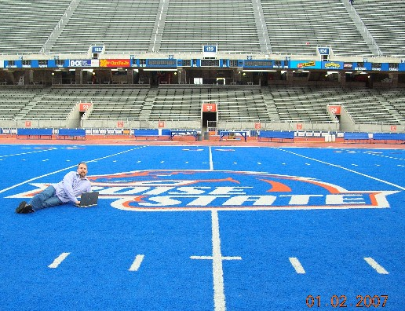
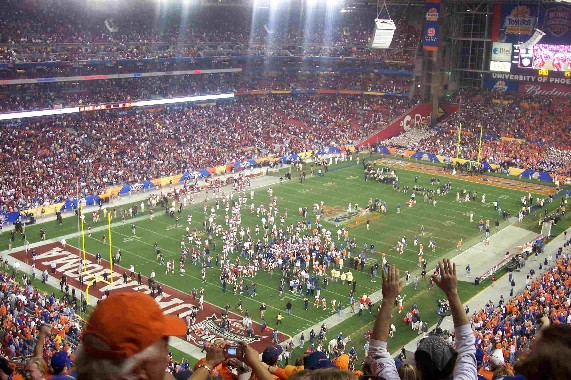

What a better place to run <a href="http://www.microsoft.com/windowsvista/" target="none" rel="noopener">Microsoft Windows Vista</a> and <a href="http://office.microsoft.com/" target="none" rel="noopener">Microsoft Office 2007</a> than at the 50 yard line of the Boise State University <a href="http://www.broncosports.com/" target="none" rel="noopener">Broncos</a>.

If you haven't heard, we <a href="http://www.broncosports.com/ViewArticle.dbml?DB_OEM_ID=9900&amp;ATCLID=736125" target="none" rel="noopener">won</a> the Tostitos Fiesta Bowl championship last night with a <a href="http://sports.espn.go.com/espn/columns/story?columnist=forde_pat&amp;id=2716979" target="none" rel="noopener">series of do-or-die trick moves</a>, including the high-school favorite <a href="http://en.wikipedia.org/wiki/Statue_of_Liberty_play" target="none" rel="noopener">State of Liberty play</a>!

Go Broncos!
&gt; Update (9 Jan, 2007) ... a photo sent to me by my&nbsp;friend Aaron (arms up) from the game itself ...  