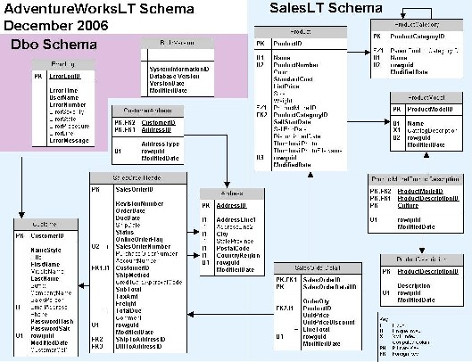

Trainers and presenters have been wanting a sample database that is less complex than AdventureWorks, but more interesting than Northwind. Thanks to my friends at SolidQ for letting me know about AdventureWorksLT (Light) ...
 (Click to see a larger view)  

You can download AdventureWorksLT&nbsp;from <a href="http://www.codeplex.com/MSFTDBProdSamples" target="none" rel="noopener">CodePlex</a> or <a href="http://www.microsoft.com/downloads/details.aspx?familyid=e719ecf7-9f46-4312-af89-6ad8702e4e6e&amp;displaylang=en" target="none" rel="noopener">Microsoft</a>.
