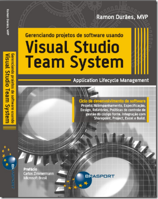

The book <em>Managing Software Development Projects using Visual Studio Team System/Application Lifecycle Management</em> is now available. The book was written be a fellow Team System MVP in Brazil, <a href="http://www.ramonduraes.net" target="_blank" rel="noopener">Ramon Durães</a>. The book is in Portuguese.  
&nbsp; 
  
&nbsp; 
Table of contents:
 <ol> <li>Application Lifecycle Management  <li>Team Foundation Server  <li>Development Methodology  <li>Work items  <li>Team Foundation Server Version Control  <li>Architecture  <li>Development  <li>Tests  <li>Database  <li>Visual Studio Team System Web Access  <li>Reports  <li>Team Foundation Build</li></ol> 
Read more about the book <a href="http://www.ramonduraes.net/post/Livro-Gerenciando-projetos-de-software-usando-Visual-Studio-Team-System.aspx" target="_blank" rel="noopener">here (in Portuguese)</a> or <a href="http://www.microsofttranslator.com/BV.aspx?ref=Internal&amp;a=http://www.ramonduraes.net/post/Livro-Gerenciando-projetos-de-software-usando-Visual-Studio-Team-System.aspx%20" target="_blank" rel="noopener">here (English translation)</a>.
 
Nice job Ramon!
