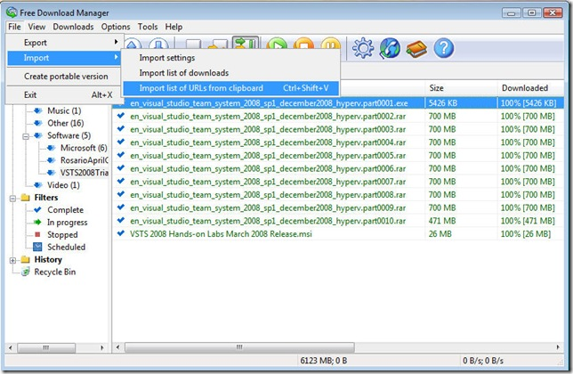

Brian Randell recently announced the availability of <a href="http://www.pluralsight.com/community/blogs/brian/archive/2008/12/24/happy-holidays-and-look-what-santa-s-brought.aspx" target="_blank" rel="noopener noreferrer">new Visual Studio Team System evaluation VPC images</a>. These virtual machines are very handy sandboxes that contain Team Foundation Server and Team Suite, all setup and ready to go. You can use these virtual machines not only for evaluating purposes, but also for learning about Team System and experimenting without worrying about messing up things.

These virtual images are set to expire in December 2009, providing a full year of use. The set consists of four versions:

<ul>

 	<li><a href="http://www.microsoft.com/downloads/details.aspx?FamilyID=c7a809d8-8c9f-439f-8147-948bc6957812&amp;displaylang=en" target="_blank" rel="noopener noreferrer">VSTS "all-up" Virtual PC/Virtual Server image</a> (6 GB download, expands to 15 GB)</li>

 	<li><a href="http://www.microsoft.com/downloads/details.aspx?FamilyID=72262ead-e49d-43d4-aa45-1da2a27d9a65" target="_blank" rel="noopener noreferrer">TFS "only" Virtual PC/Virtual Server image</a> (3 GB download, expands to 8 GB)</li>

 	<li><a href="http://www.microsoft.com/downloads/details.aspx?FamilyID=9eb65c97-29c9-4d05-ae45-73d22ad4b86e" target="_blank" rel="noopener noreferrer">VSTS "all-up" Hyper-V image</a> (6 GB download, expands to 15 GB)</li>

 	<li><a href="http://www.microsoft.com/downloads/details.aspx?FamilyID=39644cdd-db4d-445e-b087-dd3e3cdf03fb" target="_blank" rel="noopener noreferrer">TFS "only" Hyper-V image</a> (3 GB download, expands to 8 GB)</li>

</ul>

Use the links above to navigate to the download pages for these virtual machines. But, if you prefer not to download eleven massive files one at a time, you can use <a href="http://www.freedownloadmanager.org/" target="_blank" rel="noopener noreferrer">Free Download Manager</a> to queue up and download all the files automatically.

The text file below contains a list of the files to download for each virtual image. Simply copy the list for the image you want, then paste the list into Free Download Manager using Ctrl-Shift-V.

<a href="Team_System_2008_SP1_Trial_Image_Download_List.txt">Team_System_2008_SP1_Trial_Image_Download_List.txt (5.93 KB)</a>