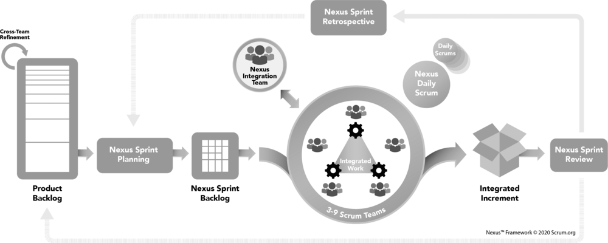

People hear "Sprint Planning at scale" and imagine a giant meeting with sixty people in a room trying to plan one enormous Sprint. That's not how Nexus Sprint Planning works, and if that's what you're doing, stop. The flow is more sensible than that, and it starts well before anyone sits down to plan.

<strong>It starts with cross-team Refinement</strong>

In single-team Scrum, Product Backlog refinement is optional and not even an event. In a Nexus, Refinement is a proper event and it's required, because at scale it does double duty. It identifies dependencies across teams, and it helps those teams forecast which will deliver which PBIs. The Product Backlog must be decomposed so that dependencies are identified and removed or minimized, and refinement continues until PBIs are sufficiently independent to be worked on by a single Scrum Team without excessive coordination.

This is the most important part to get right. The goal of cross-team Refinement is to minimize dependencies before planning, so that when teams plan, they can largely plan on their own. Skip it, and Nexus Sprint Planning collapses into a dependency-untangling session, which is exactly what you're trying to avoid.

<figure class="wp-block-image size-large has-custom-border"></figure>

<strong>Send the right representatives</strong>

The purpose of Nexus Sprint Planning is to coordinate the high-level activities of all the Scrum Teams for a single Sprint. The Product Backlog should already be adequately refined, with dependencies identified and minimized, before this happens. Appropriate representatives from each Scrum Team meet to discuss and review the refined Product Backlog, validate the ordering, and select PBIs for each team. The Product Owner provides domain knowledge and guides the selection and priority decisions. Note the word "appropriate." You send representatives, not everyone, to do the cross-team coordination.

<strong>Set the Nexus Sprint Goal</strong>

The outcome of this coordination is a single Nexus Sprint Goal: an objective that captures the essence of all the work the teams will perform this Sprint. It crosses teams, which makes it closer in spirit to a release goal than a single team's Sprint Goal. It gives every individual in the Nexus, and there may be a lot of them, meaning and focus so they don't get lost in the noise. If it's hard to craft a Nexus Sprint Goal, that's a signal worth heeding: maybe all the teams share is a codebase, and maybe they shouldn't be in a Nexus at all.

<strong>Then each team plans its own Sprint</strong>

Here's the part people miss. After the cross-team work, each Scrum Team then plans its own Sprint, interacting with other teams as appropriate. The result is a set of individual Sprint Goals that align with the overarching Nexus Sprint Goal, each team's own Sprint Backlog, and a single Nexus Sprint Backlog that makes the selected PBIs and any dependencies transparent. The teams still do real, ordinary <a href="https://scrumguides.org/" target="_blank" rel="noopener">Scrum</a> Sprint Planning. The Nexus layer just sits on top to align them.

Refine across teams to kill dependencies, send the right people to coordinate, set one Nexus Sprint Goal, then let each team plan its own Sprint. That's the flow. Sounds like good Scrum to me.

