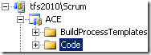
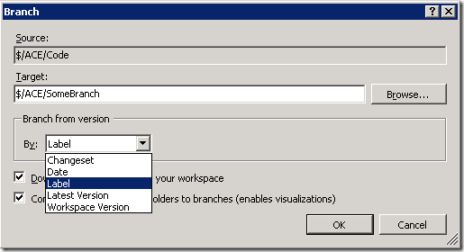
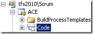
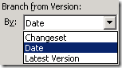

This came up today during a presentation I was giving. I didn’t realize you couldn’t do this from the new Branches in 2010. I did some research and wanted to share my findings.
 
In TFS 2010 (RC), if you right-click on a regular folder, such as my Code folder:
 
 
 
… your branching options are (Changeset, Date, Label, Latest Version, and Workspace Version):
 
 
 
But, if you convert that folder to the new Branch type in 2010:
 
 
 
… your branching options are reduced to just (Changeset, Date, and Latest Version):
 
 
 
The good news is that you can still use the TF.exe command-line utility to Branch by Label.
 
I hope Microsoft will address this by RTM (or shortly thereafter), because this begs the question: why convert to branches in the first place? Sure, if you don’t convert to a branch, you’ll be losing a layer of meta-data (owner, description, security permissions, etc.) and semantics, not to mention the slick visualization capabilities (View Branch Hierarchy and Track Changeset), but I’m not sure it outweighs the pain of having to go to the command line to Branch by Label (should that be your thing).
