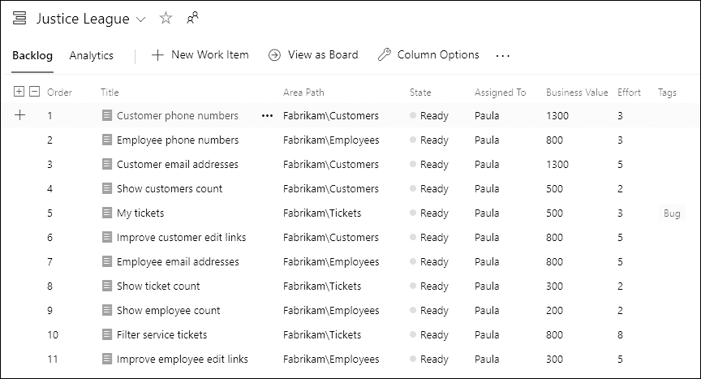

When organizations scale Scrum to several teams, the first thing that tends to fracture is the backlog. Every team wants its own list, and before long you have three or four backlogs, three or four orderings, and nobody with a coherent view of the whole product. That's a mistake. In a scaled setup, there is one Product Backlog and one Product Owner. Full stop. Each team's view is filtered, but it's still one backlog underneath.

<strong>One backlog, one Product Owner</strong>

The single-backlog discipline isn't an Azure DevOps quirk, it's core to scaling Scrum. A Nexus contains three to nine Scrum Teams but only one Product Owner. That's possible because on each team the Product Owner is a role, not a separate person, and all those roles are played by one person. There is a single Product Backlog for the entire Nexus, and the Product Owner is accountable for its content, availability, and ordering. At scale, the backlog has to be understood at a level where dependencies across teams can be detected and minimized, which is why PBIs get split and refined into thinly sliced functionality.

Hold the line on this. The value of a single ordered list is that one person, the Product Owner, is making one set of priority decisions for the whole product. Split the backlog and you've split that accountability, and the teams start optimizing locally instead of for the product.

<strong>How the filtered views work</strong>

Here's the part that makes the single backlog livable in practice. Each team gets its own view, filtered by area. When a team views the Product Backlog, only PBIs in the areas selected for that team are displayed. So a team focused on a few product areas sees just the slice of the backlog it can work on, while still pulling from the one true list.

<figure class="wp-block-image size-large has-custom-border"></figure>

The default team, which I like to rename the Nexus Integration Team, should see everything. That's possible because its only selected area is the root, including sub-areas. This matters because the Product Owner needs an unfiltered view of the entire Product Backlog to do the job. The other teams see only their PBIs, which keeps them focused, and the filter is nothing more than which areas they've selected.

Teams new to a Nexus are often specialized and can only work in a few areas, so their filtered view is narrow. As they improve and grow into true feature teams capable of working anywhere in the product, their view widens, eventually showing all PBIs, because they can take on any of them. The filtering shrinks as the teams' capability grows, which is exactly the direction you want.

<strong>The takeaway</strong>

Resist the urge to give every team its own backlog. Keep one Product Backlog, one Product Owner, and let area-based filtering give each team the focused view it needs. The list stays whole, the priorities stay coherent, and the dependencies stay visible. That's how <a href="https://scrumguides.org/" target="_blank" rel="noopener">Scrum</a> scales without losing its shape. Sounds like good Scrum to me.

