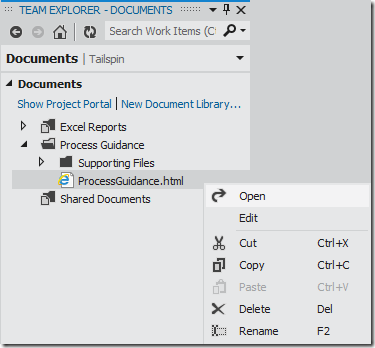
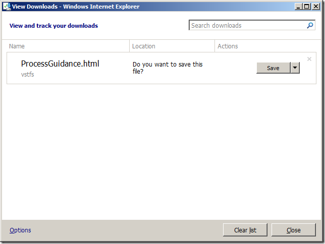
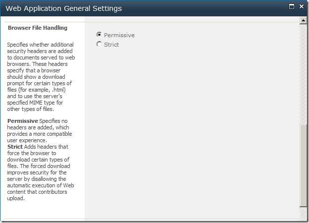

---
title: "Opening SharePoint documents in Visual Studio 11"
date: 2012-03-16T06:46:18Z
authors: ["Richard Hundhausen"]
slug: "opening-sharepoint-documents-in-visual-studio-11"
draft: false
tags: ["TFS", "Microsoft"]
---

---

Today I was trying to open the ProcessGuidance.html file ...
 

 
A double-click, or a right-click &gt; Open both resulted in Internet Explorer asking me if I want to Save or Cancel the document download. This was a surprise. I was expecting it to just open the web page.
 

 
It turns out that this is a setting in SharePoint Foundation 2010. Here are the steps I followed to fix this:
 <ol> <li>Launched SharePoint 2010 Central Administration.</li> <li>Clicked Application Management &gt; Manage web applications.</li> <li>Selected my web application.</li> <li>Selected General Settings.</li> <li>Scrolled down and selected <em>Permissive</em> Browser File Handling.</li></ol> <blockquote> 

 
Now the document opens up in the browser, rather than prompting me to save it!
</blockquote>
